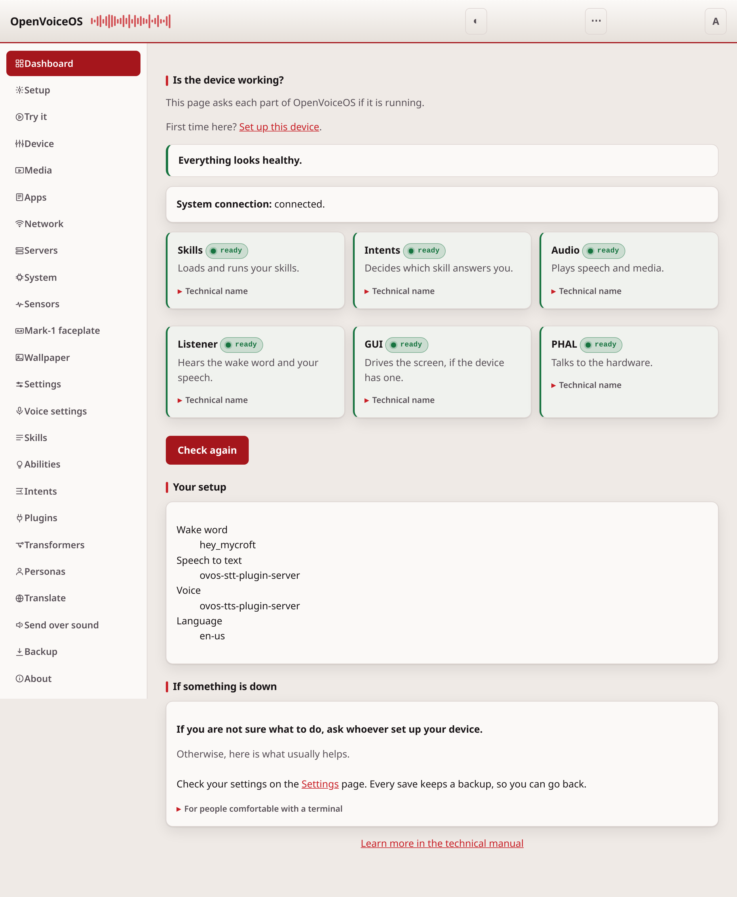

# ovos-control-panel

A local web page for an OpenVoiceOS device. It runs on the device. It shows you
if the device works, it lets you change the settings, and it makes backups.

There is no cloud account and no internet connection. Every file the page needs
is in the package.



**[Read the full guide — start here](docs/README.md)**

## What you can do

| Page | What it does |
| --- | --- |
| [Dashboard](docs/dashboard.md) | Shows if the message bus and each OVOS service answer. |
| [Settings](docs/configuration.md) | Changes your layer of `mycroft.conf`, as a form or as raw JSON or YAML. |
| [Skills](docs/skill-settings.md) | Changes the settings of each installed skill. |
| [Plugins](docs/plugins.md) | Finds OVOS plugins and installs them on the device. |
| [Personas](docs/personas.md) | Makes and edits personas — the ordered list of solvers that answer you. |
| [Translate](docs/translate.md) | Translates what a skill says and hears into your language. |
| [Backup](docs/backup-restore.md) | Downloads a copy of your settings, and puts a copy back. |
| [About](docs/about.md) | Shows the installed package versions and useful links. |

Signing in is covered in [security.md](docs/security.md). The interface is
keyboard- and screen-reader-friendly and follows the device language, including
right-to-left — see [accessibility.md](docs/accessibility.md).

The page works on a phone. It follows the light or dark setting of your device.

## Install

```bash
pip install ovos-control-panel
```

## Run

```bash
ovos-control-panel                        # 127.0.0.1:8500, this device only
ovos-control-panel --host 0.0.0.0 --token my-secret   # reachable from your phone
ovos-control-panel --port 9000
ovos-control-panel --no-bus               # do not connect to the message bus
```

Then open `http://<the address of your device>:8500/`. If a token is set, the
page asks you to sign in once and then remembers you in a cookie.

## Run it as a service

Write this to `~/.config/systemd/user/ovos-control-panel.service`:

```ini
[Unit]
Description=OpenVoiceOS Web UI
After=ovos-messagebus.service
Wants=ovos-messagebus.service

[Service]
Type=simple
ExecStart=%h/.venvs/ovos/bin/ovos-control-panel --host 0.0.0.0 --port 8500 --token CHANGE-ME
Restart=on-failure
RestartSec=5

[Install]
WantedBy=default.target
```

Then start it:

```bash
systemctl --user daemon-reload
systemctl --user enable --now ovos-control-panel
journalctl --user -u ovos-control-panel -f
```

The service starts even when the message bus is down. The dashboard then tells
you that the bus does not answer.

## Security

The page changes the configuration of your device, so treat it like a key.

- The default bind is `127.0.0.1`, so only a user of the device can reach it.
- On any other address, set a token. Put it in `mycroft.conf`:

  ```json
  {"webui": {"access_token": "a long random string"}}
  ```

  Or start the service with `--token`. The page then asks you to sign in. The
  token goes in the body of a POST and comes back as a cookie, so it never
  appears in an address, a log or the browser history.
- With a token set, every page, asset and API call needs a sign in. Only the
  sign in page, `/api/status`, `/api/login`, `/api/logout` and `/healthz`
  answer without one.
- Requests that change something must come from this page, not from another
  web site.
- Without a token on a network address, the page shows a red banner.
- The service never runs a shell command.
- Do not put this page on the public internet. It has no TLS.

## Backups

Every save first copies the old file into a `.ovos-webui-backups` directory
beside it. The name of the copy holds the time of the save. The last 20 copies
are kept. To undo a change, copy a backup back over the file.

## Documentation

The full guide, with a page-by-page navigation table and a first-run
walkthrough, lives in [docs/README.md](docs/README.md).

## Development

```bash
pip install -e .[dev]
pytest tests -v
```

The tests need no network and no message bus. Bus behaviour is tested with
`FakeBus` from `ovos-utils`.

## Related projects

- [ovos-config](https://github.com/OpenVoiceOS/ovos-config) — the configuration
  layers this page writes to
- [ovos-busmon](https://github.com/OpenVoiceOS/ovos-busmon) — watch the messages
  on the bus while you debug
- [ovos-yaml-editor](https://github.com/OpenVoiceOS/ovos-yaml-editor) — a
  smaller editor for the configuration file alone
- [ovos-plugin-manager](https://github.com/OpenVoiceOS/ovos-plugin-manager) —
  the source of the plugin lists in the Settings page
- [ovos-core](https://github.com/OpenVoiceOS/ovos-core) — the services the
  dashboard asks about

## License

Apache-2.0 — see [LICENSE](LICENSE).

## Credits

Developed by [TigreGotico](https://tigregotico.pt) for
[OpenVoiceOS](https://openvoiceos.org).

Funded by [NGI0 Commons Fund](https://nlnet.nl/project/OpenVoiceOS) /
[NLnet](https://nlnet.nl) under grant agreement No
[101135429](https://cordis.europa.eu/project/id/101135429), through the European
Commission's [Next Generation Internet](https://ngi.eu) programme.
