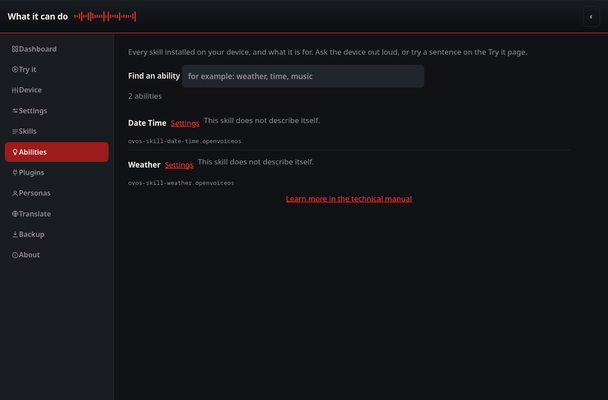

# What it can do

A plain-language list of every skill installed on the device, with the one-line
description from each skill's own package, and a filter to find one. Ask the
device out loud, or try a sentence on the [Try it](tryit.md) page.

The list is read locally from installed distribution metadata and the skill
settings directory — no network, no guessing at example phrases. A skill with
settings links through to the [Skills](skill-settings.md) page.
