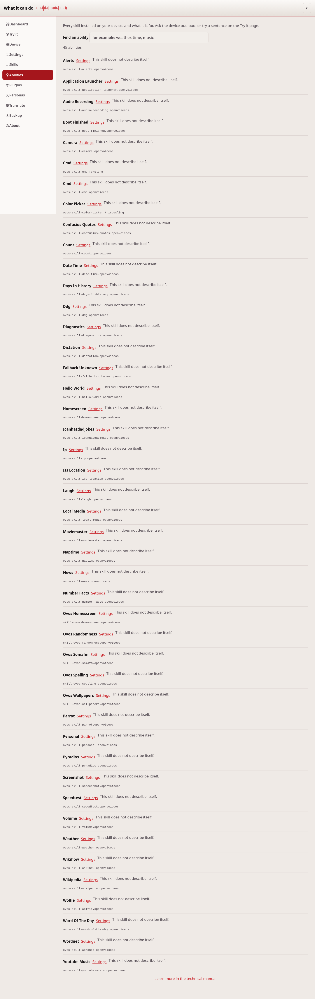
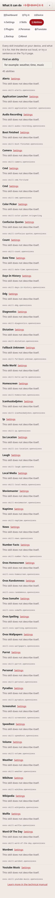

# What it can do

This page answers "what can I ask this device?" It lists every skill
installed on the device, with the one-line description from each skill's own
package, and a filter to find one.

## Common tasks

- **Find out what the device can do**: scroll or filter the list.
- **Try one out**: read the skill's description, then say it to the device
  out loud, or type a sentence on the [Try it](tryit.md) page.
- **Change how a skill behaves**: a skill with settings links through to the
  [Skills](skill-settings.md) page.

The list comes from installed distribution metadata and the skill settings
directory on the device. It needs no network and no guessed example phrases.

## If it doesn't work

If a skill you installed is missing from this list, see
[troubleshooting.md](troubleshooting.md).

---
[← Skill settings](skill-settings.md) · [Home](README.md) · [Intents →](intents.md)
