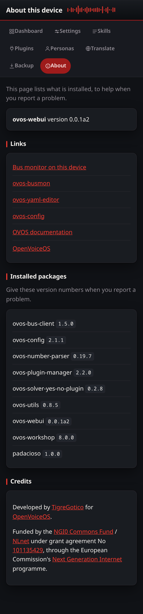

# About

The About page shows what is installed on this device and where to get help.

## What it shows

- The version of ovos-webui, and the versions of the main OVOS packages it
  found.
- The address the page is served on.
- Links to the OpenVoiceOS documentation, the chat, and the source code.

## When to use it

Open this page when you report a problem. The version list is the first thing
a maintainer asks for, and it saves you looking each package up by hand.
