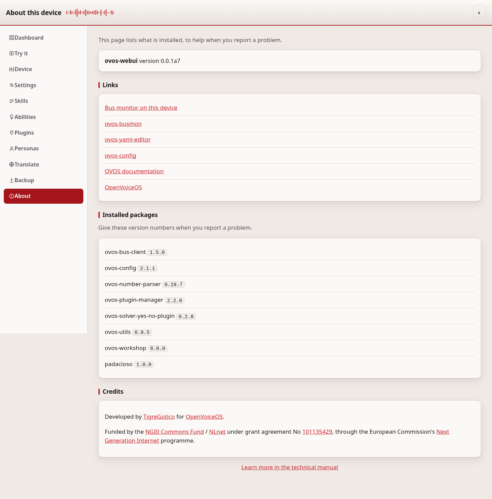
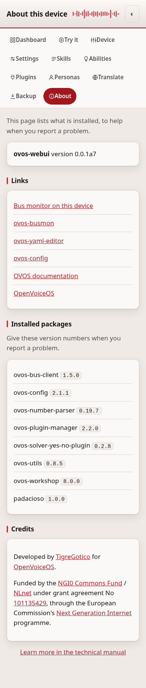
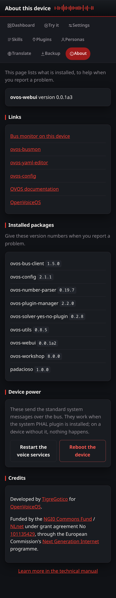

# About

The About page shows what is installed on this device and where to get help.

## Common tasks

- **Report a problem** — open this page and copy the version list into your
  report; see "When to use it" below.
- **Find the documentation or chat** — use the links on this page.
- **Restart or reboot the device** — see "Device power" below.

## What it shows

- The version of ovos-webui, and the versions of the main OVOS packages it
  found.
- The address the page is served on.
- Links to the OpenVoiceOS documentation, the chat, and the source code.

## When to use it

Open this page when you report a problem. The version list is the first thing
a maintainer asks for, and it saves you looking each package up by hand.

## Device power

The About page can send the standard system messages over the bus:
`system.mycroft.service.restart` and `system.reboot`. They are acted on by
`ovos-PHAL-plugin-system` where it is installed; on a device without it the
message is ignored and nothing happens. Both need the access token and a
confirmation, and the page never runs a shell command itself.

## If it doesn't work

If a version is missing from the list, that package is not installed on this
device. For anything else, see [troubleshooting.md](troubleshooting.md).
