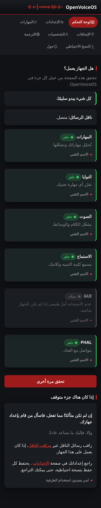
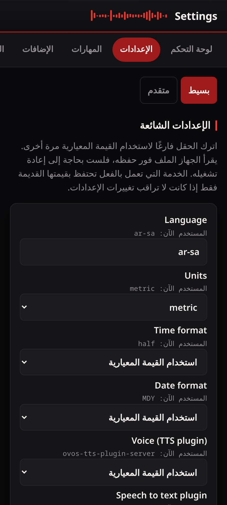

# Accessibility and languages

## Accessibility

The interface is built to be used without sight or a mouse.

- Every page starts with a **Skip to content** link, so a keyboard or screen
  reader user can jump past the navigation.
- The page is one `header`, one `nav` (named for a screen reader), and one
  `main` landmark, so a screen reader can move between them.
- Every control has a real label, and the keyboard focus ring is always
  visible.
- Status that changes on its own is announced to a screen reader as it
  changes. This covers the service checks on the dashboard, the "saved" and
  error messages, and the insecure-network warning.
- The colour of a status is never its only signal: each one also carries a
  word (`ready`, `starting`, `no answer`, `off`, `waiting`).
- Motion is small, and it is turned off for anyone who asks the system to
  reduce motion.

## Languages and right-to-left

The interface follows the device language. Set `lang` in `mycroft.conf` (for
example `ar-sa`, `he-il`, `pt-pt`) and the page shows that language and, for a
right-to-left language, flips the whole layout to read right-to-left.

Translations live in `ovos_webui/static/i18n/`, one file per language, keyed by
the same short keys the pages carry. English is written into the pages
themselves and is the fallback, so a missing translation shows English rather
than nothing. To add a language, copy `en.json` to `<code>.json` and translate
the values. See `ovos_webui/static/i18n/README.md`.

## On a computer

The layout is phone-first but responsive. At 1024px and wider the tab bar
becomes a left rail, with each tab a full-width target and the current page
marked with `aria-current="page"`. The content fills the width: the dashboard
flows into two or three columns, and Settings into a two-column field grid.
Forms hold a readable measure rather than stretching a single control across
the screen. Nothing is hidden on either size. It is the same markup reflowed
with CSS.

## More live-region care

- The scrollable log and preview panes carry `tabindex="0"` so they can be
  scrolled from the keyboard.
- The Try-it result is a polite live region that first says "Asking the
  device…" then the answer. The button is never disabled mid-request, so
  focus is never dropped.
- The live activity feed does not auto-announce, because that would
  interrupt. A Pause control stops it, and its label carries the state.
- Opening a backup preview moves focus into the labelled region; closing it
  returns focus to the row it came from.

## Choosing a theme

The header carries a theme control that cycles match-my-device, dark, and
light. The choice is saved in the browser and applied before the page paints,
so there is no flash. "Match my device" follows the operating-system
light/dark setting. The control names the current theme for a screen reader.

---
[← Security](security.md) · [Home](README.md) · [Updates →](updates.md)
