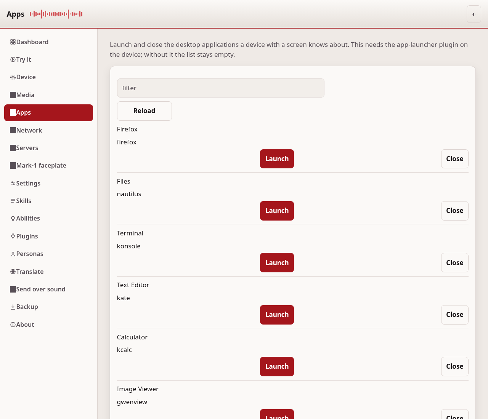
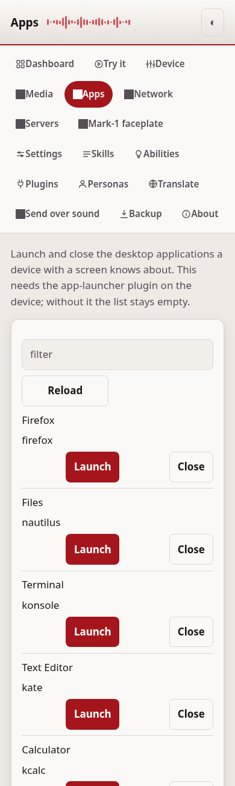

# Apps

The Apps page launches and closes the desktop applications a device with a
screen knows about. It talks to the app-launcher plugin on the device. A device
without that plugin, or without a screen, shows an empty list and says the
app-launcher did not answer.

## Launch or close an app

Each application in the list has a name and the command that runs it. Press
Launch to start it on the device's screen, or Close to stop it. The page
reports what happened, including the reason when an app does not start.

## Find an app

Type in the filter box to narrow the list by name. Press Reload to fetch the
list again, for example after you install a new application on the device.

## This page needs a token

Launching and closing applications changes what the device is doing, so this
page needs an access token, the same as the other device pages. Set one on the
[Settings](configuration.md) page first.

---
[← Media](media.md) · [Home](README.md) · [Network →](network.md)
