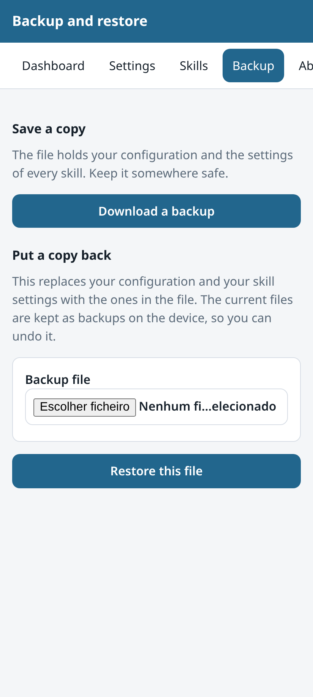

# Backup and restore

## What is in a backup

A backup is one `.tar.gz` file with two things:

- `config/mycroft.conf` — your layer of the configuration
- `skills/<skill id>/settings.json` — the settings of each skill

It holds nothing else. It holds no audio, no model and no log.

## Make a backup

Open the Backup page and press **Download a backup**. The file name holds the
date and time, for example `ovos-webui-backup-20260810T175403Z.tar.gz`.

Keep the file somewhere else than the device. A backup on a broken SD card is
not a backup.

## Put a backup back

Choose the file and press **Restore this file**. The page asks you to confirm.

The restore replaces your configuration and your skill settings with the ones in
the file. Before it replaces a file, it copies the current one into
`.ovos-webui-backups`. So a restore can be undone.

## What a restore refuses

The page checks the whole archive before it writes anything. It refuses the
archive as a whole when it finds:

- a member with an absolute path, or with `..` in it
- a symbolic link or a hard link
- a file that is not `config/mycroft.conf` and not
  `skills/<skill id>/settings.json`
- a skill id that is not a plain name
- an upload over 16 MB, or an archive that unpacks to over 64 MB
- an archive with more than 5000 members
- an archive with nothing to restore

If one member is bad, nothing is written at all.
