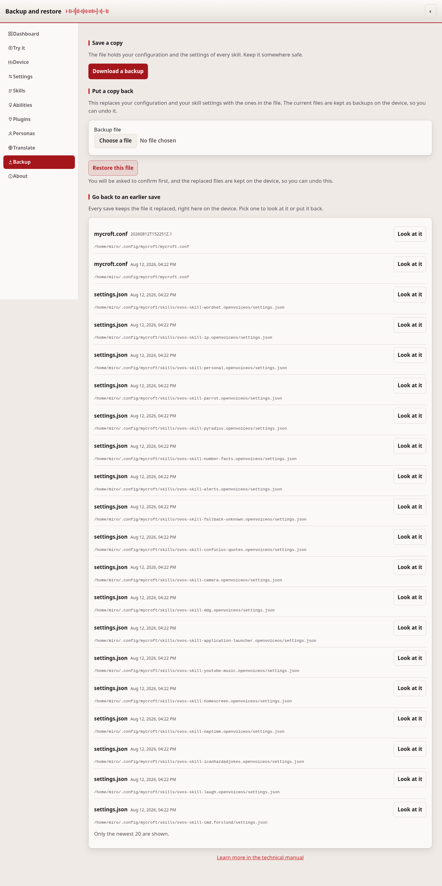
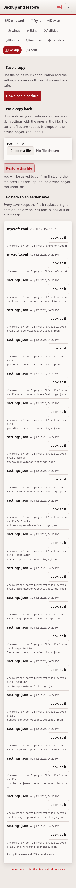
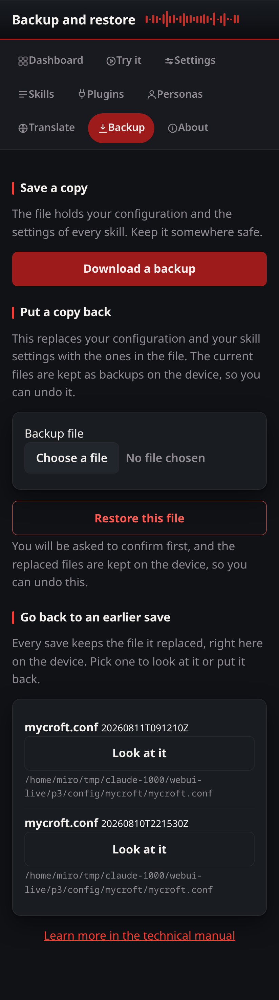

# Backup and restore

This page saves your device's configuration and skill settings to a file, and
puts them back if something goes wrong.

## Common tasks

- **Save your setup before making a big change** — press **Download a
  backup**, and keep the file somewhere else than the device.
- **Move your setup to a new device** — download a backup on the old one,
  then open this page on the new one and restore it.
- **Undo a change you didn't mean to make** — see "Go back to an earlier
  save" below.

## What is in a backup

A backup is one `.tar.gz` file with two things:

- `config/mycroft.conf` — your layer of the configuration
- `skills/<skill id>/settings.json` — the settings of each skill

It holds nothing else. It holds no audio, no model and no log.

## Make a backup

Open the Backup page and press **Download a backup**. The file name holds the
date and time, for example `ovos-control-panel-backup-20260810T175403Z.tar.gz`.

Keep the file somewhere else than the device. A backup on a broken SD card is
not a backup.

## Put a backup back

Choose the file and press **Restore this file**. The page asks you to confirm.

The restore replaces your configuration and your skill settings with the ones in
the file. Before it replaces a file, it copies the current one into
`.ovos-webui-backups`. So a restore can be undone.

## What a restore refuses

The page checks the whole archive before it writes anything. It refuses the
archive as a whole when it finds:

- a member with an absolute path, or with `..` in it
- a symbolic link or a hard link
- a file that is not `config/mycroft.conf` and not
  `skills/<skill id>/settings.json`
- a skill id that is not a plain name
- an upload over 16 MB, or an archive that unpacks to over 64 MB
- an archive with more than 5000 members
- an archive with nothing to restore

If one member is bad, nothing is written at all.

## Go back to an earlier save

Every save this app makes first copies the old file into a
`.ovos-webui-backups` directory next to it. The "Go back to an earlier save"
list shows those copies, newest first, lets you read one, and puts it back.

A revert goes through the same atomic write as every other save, so the file
being replaced is itself backed up first — a revert can always be reverted.
A backup is addressed only by a checked identifier that must resolve to a
`*.bak` file inside a `.ovos-webui-backups` directory under the configuration
home; nothing else on the disk is reachable, and symlinks are refused.

## If it doesn't work

If a restore is refused, the archive fails one of the checks listed above.
The page tells you which one. For anything else, see
[troubleshooting.md](troubleshooting.md).

---
[← Wallpaper](wallpaper.md) · [Home](README.md) · [About →](about.md)
