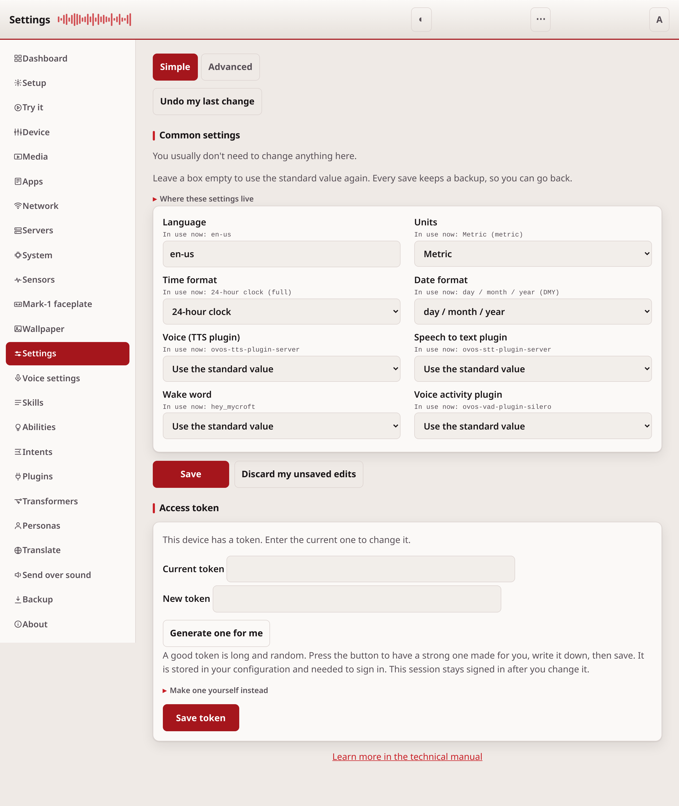
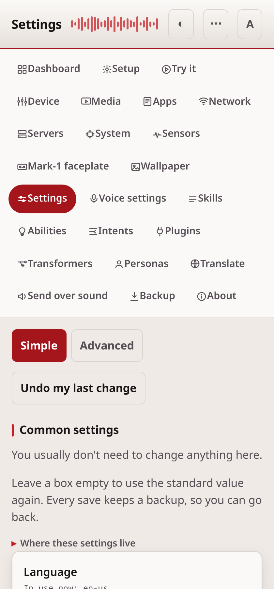

# Settings

The Settings page changes your own layer of `mycroft.conf`, the file that
controls how the device behaves. Use it to change language, voice, or wake
word without touching a file by hand.

## Common tasks

- **Change the wake word or voice**: open the Simple tab, pick the new value
  from the list, and it saves right away.
- **Switch the device to your language**: set Language on the Simple tab.
- **Edit a setting the Simple tab does not show**: use the Advanced tab. See
  below.
- **Undo a change**: leave the field empty, or choose "Use the standard
  value". Every save is also backed up automatically. See "After a save".

## The layers

OVOS reads several configuration files and puts them on top of each other. Your
file is the last one, so your values win. Your file only holds what you changed.
Everything else comes from the standard files.

The page never writes to the standard files.

## Simple

The Simple tab shows the settings that most people change:

| Field | What it does |
| --- | --- |
| Language | The language the device speaks and hears. |
| Units | Metric or imperial. |
| Time format | 12 hour or 24 hour. |
| Date format | Day first or month first. |
| Voice (TTS plugin) | The plugin that speaks. |
| Speech to text plugin | The plugin that turns your speech into text. |
| Wake word | The name the device listens for. |
| Voice activity plugin | The plugin that finds where your speech stops. |

Each field shows the value in use now, under its label.

The plugin lists hold only the plugins installed on this device. The wake word
list holds only the wake words named in the `hotwords` section, so you cannot
type a name that does not exist.

Leave a box empty, or choose "Use the standard value", to remove the key from
your file. The standard value then applies again.

## Advanced

The Advanced tab shows your whole file. You can read and write it as JSON or as
YAML. The page checks the text before it saves. Text that is not valid, or that
is not a mapping at the top level, is refused and nothing is written.

## After a save

Most settings apply as soon as you save. `ovos-config` watches the file and
reads it again when it changes, which is what makes a change visible to a
running service. When the message bus is up the page also sends the existing
`configuration.patch` message; ovos-audio and the listener act on it, and the
skills service does not bind it at all.

Two kinds of setting need the OVOS services restarted. Units, time format and
date format are read from the session, which is built once when the skills
service starts. Changing the voice does not always take effect either, because
ovos-audio decides whether to reload by hashing the selected plugin's own
settings and not the plugin name, so a swap between two plugins that have no
settings of their own looks like no change to it.

If something does not change, restart the OVOS services. The Device page has a
button for it, which works where `ovos-PHAL-plugin-system` is installed; without
that plugin, restart them from a terminal.

Every save first copies the old file into `.ovos-webui-backups` beside it.

## On a wide screen

On a computer the fields lay out in two columns, and the nav becomes a rail
down the left instead of a row of pills across the top.

## Changing the access token

The **Access token** section sets the first token on a device that has none.
It also changes an existing token, if you enter the current one. The session
stays signed in afterwards.

## If it doesn't work

If a save is refused, check that your JSON or YAML on the Advanced tab is
valid. The page tells you what is wrong. For anything else, see
[troubleshooting.md](troubleshooting.md).

---
[← Setup](setup.md) · [Home](README.md) · [Voice settings →](voice-settings.md)
