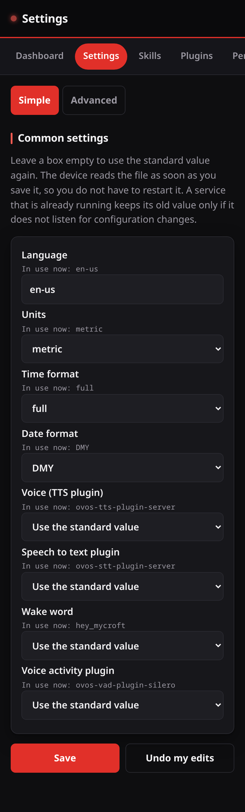
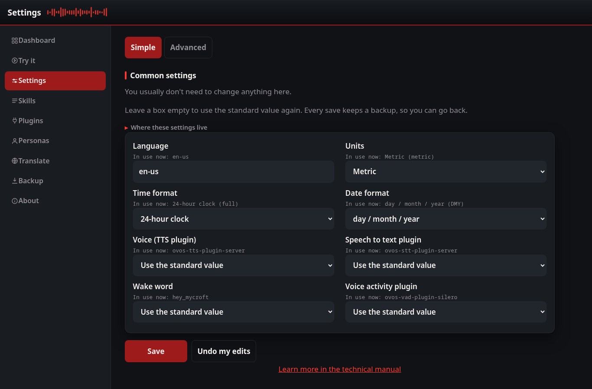

# Settings

The Settings page changes your own layer of `mycroft.conf`.

## The layers

OVOS reads several configuration files and puts them on top of each other. Your
file is the last one, so your values win. Your file only holds what you changed.
Everything else comes from the standard files.

The page never writes to the standard files.

## Simple

The Simple tab shows the settings that most people change:

| Field | What it does |
| --- | --- |
| Language | The language the device speaks and hears. |
| Units | Metric or imperial. |
| Time format | 12 hour or 24 hour. |
| Date format | Day first or month first. |
| Voice (TTS plugin) | The plugin that speaks. |
| Speech to text plugin | The plugin that turns your speech into text. |
| Wake word | The name the device listens for. |
| Voice activity plugin | The plugin that finds where your speech stops. |

Each field shows the value in use now, under its label.

The plugin lists hold only the plugins installed on this device. The wake word
list holds only the wake words named in the `hotwords` section, so you cannot
type a name that does not exist.

Leave a box empty, or choose "Use the standard value", to remove the key from
your file. The standard value then applies again.

## Advanced

The Advanced tab shows your whole file. You can read and write it as JSON or as
YAML. The page checks the text before it saves. Text that is not valid, or that
is not a mapping at the top level, is refused and nothing is written.

## After a save

You do not have to restart the device. `ovos-config` watches the file and reads
it again when it changes. When the message bus is up, the page also sends the
existing `configuration.patch` message, so the services see the change at once.

Every save first copies the old file into `.ovos-webui-backups` beside it.

## On a wide screen

On a computer the fields lay out in two columns and the tabs move to a left rail.

## Changing the access token

The **Access token** section sets the first token on a device that has none, or changes an existing one (you enter the current token to change it). The session stays signed in afterwards.
