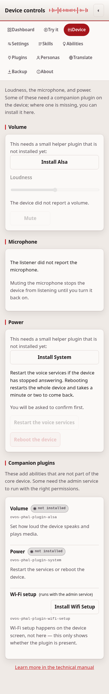

# Device controls

Loudness, the microphone, and power — the things you reach for on a real
device. Some of these are carried by companion **PHAL plugins**, and the page
tells you when one is missing and offers to install it.

## Common tasks

- **Turn the device up or down, or mute it** — use the volume slider on this
  page.
- **Stop the device from listening for a moment** — mute the microphone.
- **Restart or reboot the device** — use the buttons under Power, and confirm
  when asked.

## Volume and microphone

The volume slider and mute use the standard `mycroft.volume.*` messages; the
microphone mute uses `mycroft.mic.*`. A read that nothing answers (no volume
plugin, no listener) shows the value as unknown rather than hanging.

Volume needs an audio plugin such as `ovos-PHAL-plugin-alsa`. When it is not
installed the control is disabled and a prompt offers to install it. The
microphone mute is part of the listener, so it has no plugin to install.

## Power

Restart the voice services, or reboot the whole device. These send the
standard system messages (`system.mycroft.service.restart`, `system.reboot`),
which `ovos-PHAL-plugin-system` acts on. The page never runs a command itself,
and asks you to confirm first.

## Companion plugins

The panel lists each capability, whether its plugin is installed, and — for
capabilities without a dedicated control, like Wi-Fi setup — an install button.
Some plugins need the **admin service** (`ovos-PHAL-admin`) to run with the
right permissions; those are labelled, because installing the package is not
enough on its own for an admin plugin.

## If it doesn't work

A control that shows "unknown" has no plugin answering — install the one it
names, or see [troubleshooting.md](troubleshooting.md).
