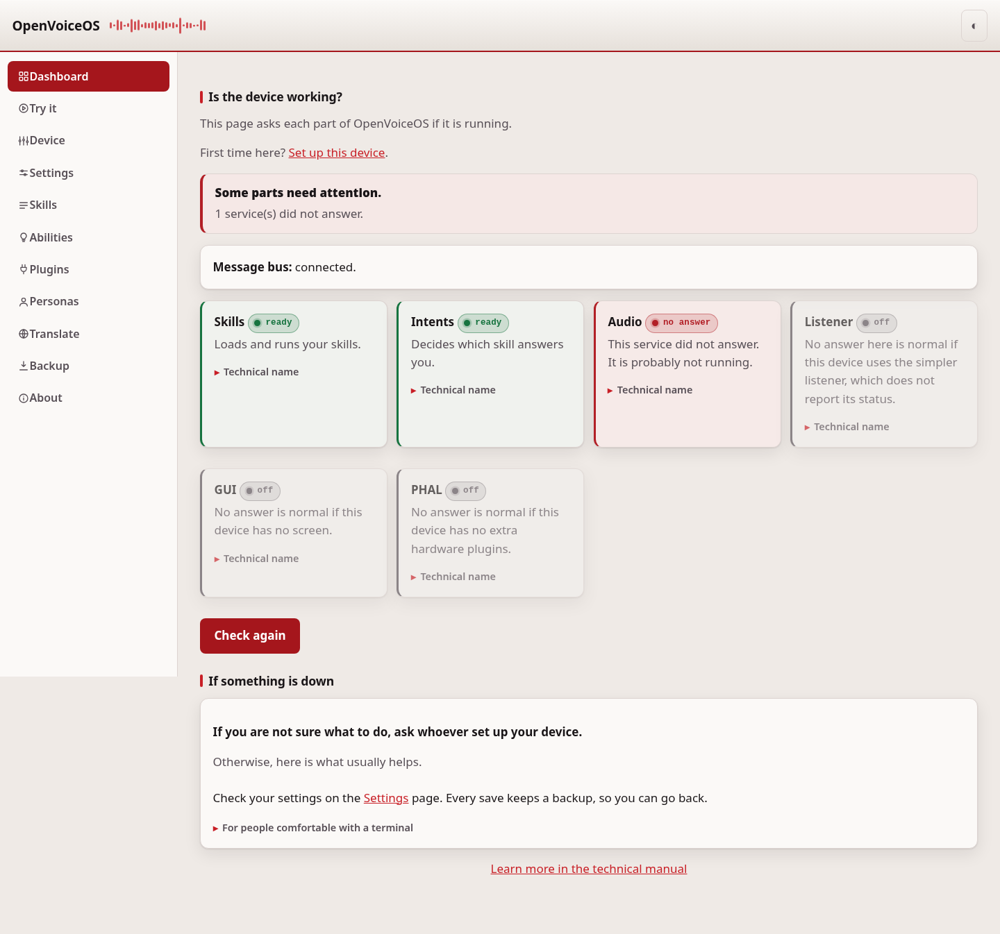

# Dashboard

The dashboard answers one question: does this device work? Open it first when
you are not sure something is running.




## Common tasks

- **Check the device is healthy** — open the dashboard. A green banner at the
  top means the core services are up. A red one names what is wrong.
- **Find out why a skill will not answer** — look for a card that is not
  "ready" and follow "If something is down" below.
- **Watch a service finish starting** — leave the page open; it keeps checking
  and the chip changes from "starting" to "ready" on its own.

## What it shows

The first card shows the message bus. Every OVOS service talks through the bus.
When the bus does not answer, no other check can answer either. Start
`ovos-messagebus` first.

Then there is one card for each service:

| Card | Service | Message it answers |
| --- | --- | --- |
| Skills | ovos-core skill manager | `mycroft.skills.is_ready` |
| Understanding | ovos-core intent service | `mycroft.intents.is_ready` |
| Audio | ovos-audio or ovos-media | `mycroft.audio.is_ready` |
| Listener | ovos-dinkum-listener | `mycroft.voice.is_ready` |
| Screen | ovos-gui | `mycroft.gui_service.is_ready` |
| Hardware controls (PHAL) | ovos-PHAL | `mycroft.PHAL.is_ready` |

## What each state means

| State | Meaning |
| --- | --- |
| ready | The service runs and has finished starting. |
| starting | The service runs but is not ready yet. Wait and check again. |
| not ready | The service answered but reports a problem. |
| no answer | Nothing answered. The service is not running. |
| off | The part is absent on this device, which is normal. Shown grey, not red. |
| waiting | The message bus is down, so the service could not be asked. |

A device without a screen has no Screen service, and a device without
hardware plugins has no Hardware controls (PHAL). Their cards show a grey
"off" chip with a one-line explanation instead of a red alarm, and they
never turn the summary banner red.

`ovos-simple-listener` does not register a status handler at all, so a device
that uses it instead of `ovos-dinkum-listener` shows the same neutral "off"
chip for the listener even while it is listening. That is a limit of this
page, not a fault on the device.

When the bus itself is down, every service card shows a grey "waiting" chip
and keeps its plain description: the red banner at the top already carries
the one real alarm, and repeating it six times would only add noise.

## How the check works

`ovos_utils.process_utils.ProcessStatus` gives every OVOS service two message
handlers, `mycroft.<name>.is_alive` and `mycroft.<name>.is_ready`. The dashboard
sends those messages and waits one second for the answer. It adds no new
message type to the bus.

All six services are asked at the same time, so the whole check costs one
second, not six.

## If something is down

Read the log of the service:

```bash
journalctl --user -u ovos-skills -n 100
```

Start it again:

```bash
systemctl --user restart ovos-skills
```

To see the messages themselves, use
[ovos-busmon](https://github.com/OpenVoiceOS/ovos-busmon). The dashboard links
to it on port 8000 of the same device.

## What this page does not do

The dashboard answers "is each part running?" — it does not measure how fast
the device answers. There is no round-trip or model latency here; use a
benchmarking tool for that.

It also does not restart services or show service logs in the browser: the
service never runs a shell command from a web request, by design (see
[security.md](security.md)). The steps under "If something is down" show the
`journalctl` and `systemctl` commands to run over SSH instead.

The summary banner at the top reflects only the core services — skills, intents
and audio. The screen, the hardware layer (PHAL) and the listener can be
legitimately absent on a given device, so their being quiet never turns the
banner to "needs attention"; their own cards still show and explain the state.

## If it doesn't work

Still stuck after restarting a service and reading its log? See
[troubleshooting.md](troubleshooting.md).
