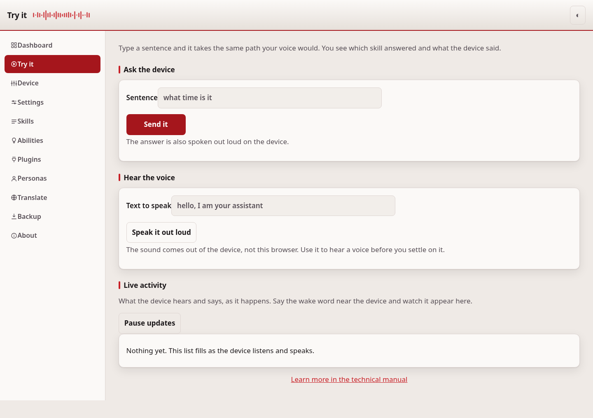

# Getting started

This walks a fresh OpenVoiceOS device from "just flashed" to "understands
you and talks back." Do the steps in order. Each one says what to click,
what you should see, and what "done" looks like.

If a step does not go as described, stop and read
[Troubleshooting](troubleshooting.md) — most first-time problems are covered
there.

## 1. Open the web page

ovos-control-panel runs on the device itself. On the same network, open a browser and
go to:

```
http://<the address of your device>:8500/
```

If you do not know the address, it is often the device's hostname, for
example `http://ovos.local:8500/`, or its numeric IP address. On the device
itself, `http://127.0.0.1:8500/` always works.

If the device is not on your Wi-Fi yet, join it from the [Network](network.md)
page once you can reach the device. A device with no screen or keyboard can be
told the Wi-Fi another way: play the credentials to it as a sound from the
[Send over sound](send-over-sound.md) page.

If the page will not load from your phone but works on the device itself, the
device is only accepting connections from itself, which is the safe default.
See [Security](security.md) under "Let yourself in from your phone" to open it
up, and set a token first.

**Done looks like:** the Dashboard loads, with a card for the message bus and
one for each service.

## 2. Set an access token


Before you install anything or send the device a command, set an access
token. A token is a password for this page: without one, anyone on your
network could change your device's settings. With one set, the page asks you
to sign in once and remembers you.

Go to **Setup** (or **Settings → Access token**) and press **Generate one for
me**. This makes a strong token right in the browser, so you do not need a
terminal. Write it down, then save. (If you would rather make your own, any
long random string works, for example the output of
`python3 -c "import secrets; print(secrets.token_urlsafe(32))"`.)

This matters for the next steps too: installing plugins, hearing the device
speak, and using the device controls all **need** a token. Skip this step and
you will hit a wall on the very next one.

**Done looks like:** the page asks you to sign in, and after you do, the red
"no token set" banner is gone.

## 3. Pick your language

Still on the Setup page, choose the language the device should speak and
listen in. This writes `lang` into your configuration, and the plugin list
below it updates to match.

**Done looks like:** the language box shows your choice, and the recommended
plugins list changes to plugins for that language.

## 4. Install ears and a voice


A device needs two plugins to hold a conversation:

- a **speech-to-text** plugin (the "ears") — turns your voice into text
- a **text-to-speech** plugin (the "voice") — turns the answer into speech

The Setup page lists ones recommended for your language. Press **Install**
next to each. You will see a live log while it installs.

**Done looks like:** both plugins show as installed. If the button does
nothing or nothing seems to happen, check that you set a token in step 2.

## 5. Test it



Go to **Try it**. Type a simple question, for example "what time is it," and
send it. This takes the exact path a spoken question would take.

You should see:

- which skill answered
- the words it answered with
- and hear the answer spoken out loud on the device

**Done looks like:** you see an answer on the page and hear it spoken. If you
see an answer but hear nothing, you likely have not installed a voice yet —
go back to step 4.

## 6. Restart the services


Plugins only take effect after the OVOS services restart. Go to **Device
controls** and restart the voice services (or reboot the device if you
changed the wake word or language).

**Done looks like:** the Dashboard shows every card as ready again after a
short wait.

## You're set up

From here:

- [Settings](configuration.md) to change the wake word, units, or plugins
- [Personas](personas.md) to decide who answers open-ended questions
- [Backup](backup-restore.md) to save a copy of what you just set up

If anything along the way did not behave as described, go to
[Troubleshooting](troubleshooting.md).

---
[Home](README.md)
