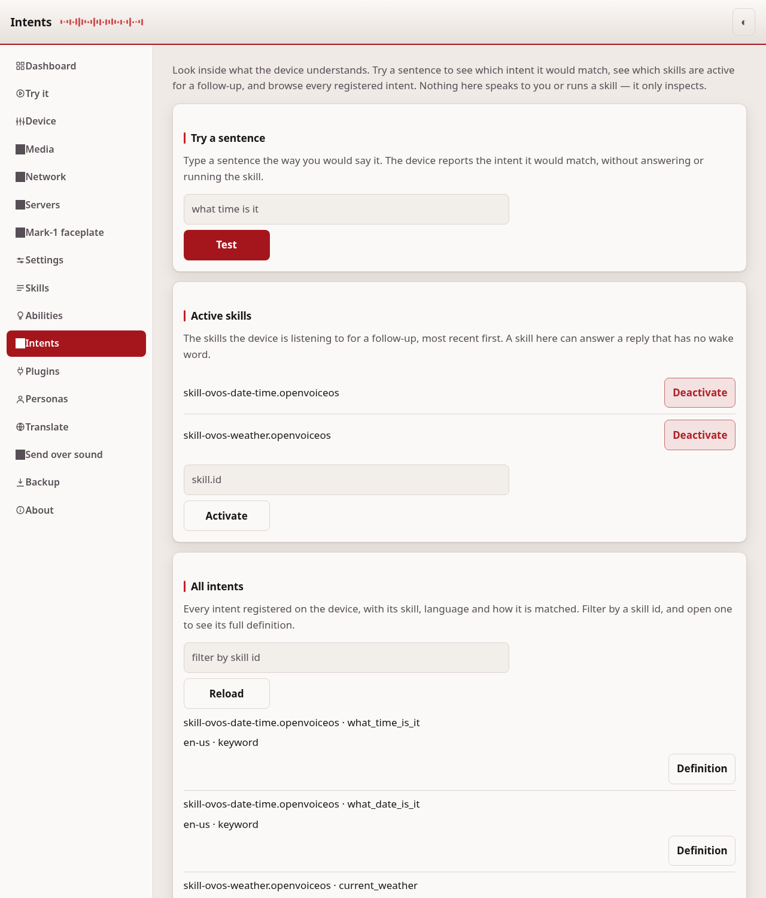
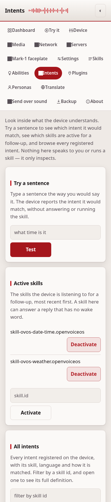

# Intents

The Intents page looks inside what the device understands. Try a sentence to
see which intent it would match, see which skills are active for a follow-up,
and browse every registered intent. Nothing on this page speaks to you or runs
a skill. It only inspects, so it is safe to explore.

## Try a sentence

Type a sentence the way you would say it and press Test. The device reports the
intent it would match: the skill, the intent name, how it was matched, and the
handler. It does not answer or run the skill. This is a dry run, so it is a
quick way to check why a command does or does not reach the skill you expect.

If nothing matches, the page says so. If the device is not running, the page
says the intent service did not answer.

## Active skills

This card lists the skills the device is listening to for a follow-up, most
recent first. A skill in this list can answer a reply that has no wake word, for
example when a skill asked you a question.

Press Deactivate to remove a skill from the list. Type a skill id and press
Activate to add one. The list refreshes to show the result.

## All intents

This card lists every intent registered on the device, with its skill,
language, and how it is matched (a keyword intent or a template intent). An
intent that is turned off is marked. Type a skill id in the filter and press
Reload to narrow the list. Press Definition on a row to see the full
registration of that intent.

## This page needs a token

The page reads from the running device and can activate or deactivate a skill,
so it needs an access token, the same as the other device pages. Set one on the
[Settings](configuration.md) page first.

---
[← Abilities](abilities.md) · [Home](README.md) · [Plugins →](plugins.md)
