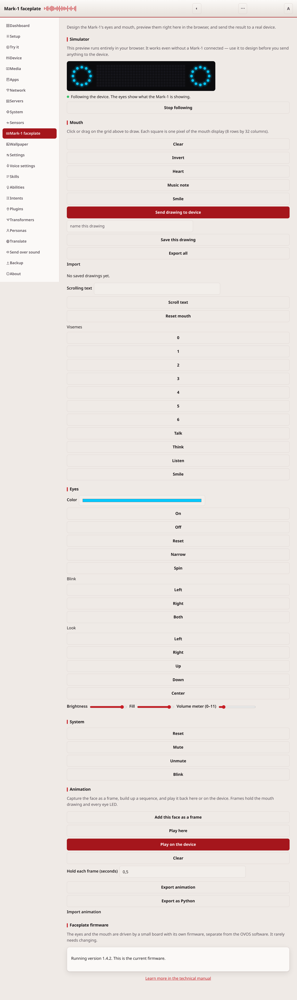
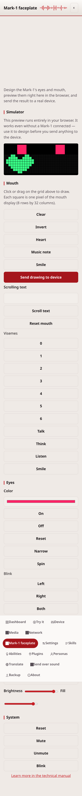

# Mark-1 faceplate

The Mark-1 faceplate page controls the eyes and the mouth of a Mark-1
device. You draw an image for the mouth. You pick a color and a state for
the eyes. You can preview the result in the browser before you send it.

## What it needs

Sending anything to real hardware needs the `ovos-PHAL-plugin-mk1` plugin.
Install it on the device first. Without the plugin, the page still works.
The simulator and the mouth editor run in the browser. Only the "send to
device" actions are disabled.

## The simulator

The simulator is a preview canvas at the top of the page. It shows the
mouth grid and two eye blocks. The eye blocks match your current color
and on/off choice.

The preview updates as you draw or change a setting. It needs no device
at all. Use it to design a faceplate before you own a Mark-1, or before
you set up the plugin.

## Draw the mouth

The mouth display is 8 rows by 32 columns of pixels. Click or drag on the
grid to turn pixels on and off.

Use **Clear** to start over, or **Invert** to swap every pixel. Three
presets load a ready-made image: **Heart**, **Music note**, and
**Smile**. Press **Send drawing to device** to show your drawing on a
connected Mark-1.

## Mouth text and animations

Type text in the **Scrolling text** field and press **Scroll text** to
show it, letter by letter, on the mouth. **Reset mouth** clears the
display. The viseme buttons (0 to 6) and the animation buttons (**Talk**,
**Think**, **Listen**, **Smile**) play the mouth's built-in shapes.

## The eyes

Pick a color with the color picker. It also updates the simulator at
once. **On** and **Off** turn the eyes on or off. **Blink** closes one
eye or both for a moment. **Look** points the eyes in a direction.
**Narrow** and **Spin** play the eyes' built-in animations.

The **Brightness** slider sets how bright the eyes glow, from 1 to 30.
The **Fill** slider sets how much of each eye is lit, from 0 to 100%.

## System

**Reset** puts the whole faceplate back to its startup state. **Mute**
and **Unmute** silence or restore the enclosure's own sounds. **Blink**
makes the enclosure blink a few times, as a visible "I heard that"
signal.

## How it talks to the device

Every control sends one of the Mark-1's own `enclosure.*` bus messages.
These are the same messages `ovos-PHAL-plugin-mk1` already listens for.
The page adds no new messages and no new device behavior. It is a
browser front end for controls the plugin has always had.

## If it doesn't work

If the page shows that no Mark-1 was found, install
`ovos-PHAL-plugin-mk1` on the device. See the [Plugins](plugins.md)
page, then reload this page. If a control seems to do nothing after
that, check that the plugin is running. For anything else, see
[troubleshooting.md](troubleshooting.md).

---
[← Servers](servers.md) · [Home](README.md) · [Backup →](backup-restore.md)
