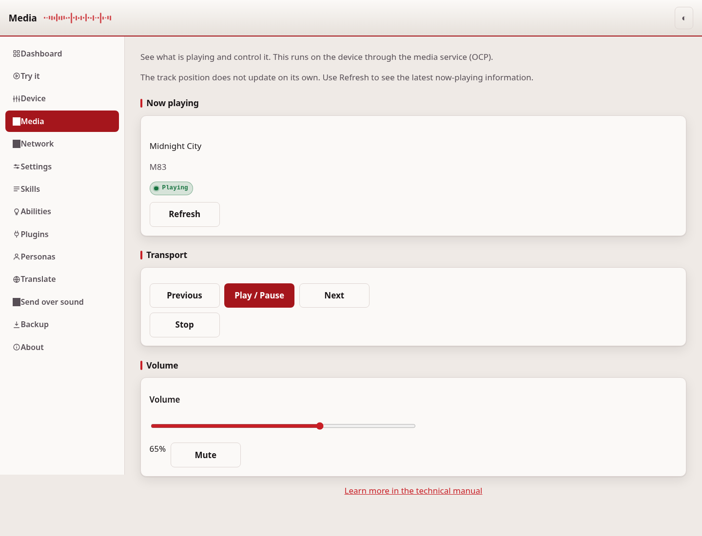
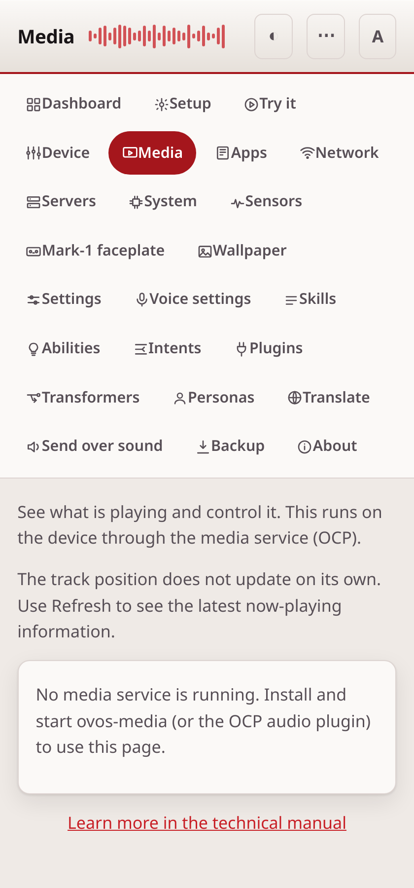

# Media

The Media page shows what the device is playing and lets you control it. You can
play or pause, skip to the next or previous track, stop playback, and set the
volume.

## What you need

The device must run a media service. This is either `ovos-media` or the older
common-play plugin. If no media service answers, the page tells you so and hides
the controls.

## Now playing

The card at the top shows the current track. It shows the title, the artist, and
the cover art when the skill provides them. It also shows the state: playing,
paused, or stopped.

The page does not update on its own. Select **Refresh** to read the current track
again.

## Controls

- **Previous** and **Next** move through the playlist.
- **Play / Pause** starts or holds playback.
- **Stop** ends playback.

## Volume

Move the slider to set the volume from 0 to 100. Select **Mute** to silence the
device, and **Unmute** to restore the sound.

---
[← Device controls](controls.md) · [Home](README.md) · [Apps →](apps.md)
