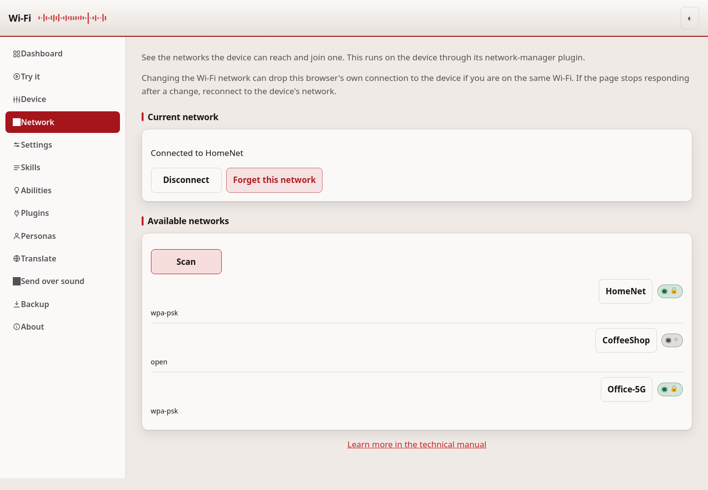
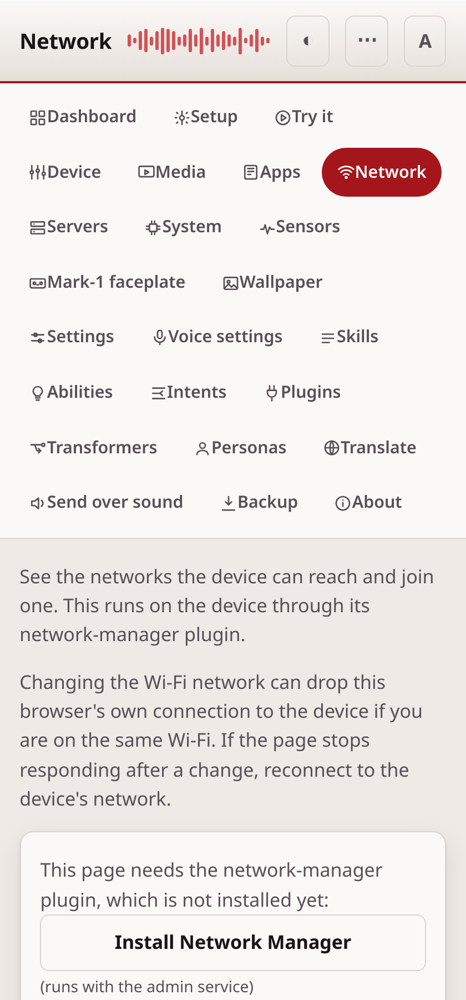

# Network

The Network page shows the Wi-Fi networks near the device, and lets you
join, leave, or forget one.

## What it needs

This page needs the `ovos-PHAL-plugin-network-manager` plugin, installed
and running on the device. Install it on the [Plugins](plugins.md) page.
Without it, the page shows a message that the plugin is missing instead of
a network list.

## Read it top to bottom

The page has two parts, in this order:

1. **Current network** — the network the device is connected to now, with
   **Disconnect** and **Forget this network** buttons.
2. **Available networks** — every network the device can reach, found by
   the last scan. Press **Scan** to look again. Each network shows its name
   and its security type exactly as `nmcli` reports it, such as `WPA2` or
   `WPA2 WPA3`. An open network reports nothing at all, and the page shows it
   as needing no password.

Press a network in the list to join it. If it needs a password, the page
asks for one before it connects.

## Before you switch networks

Switching Wi-Fi can drop the device's own connection, and your browser's
connection to the device too, if your browser is on the same network. The
page warns you of this before it switches. If the page stops responding
after a switch, reconnect your own device to the network you chose, then
open the page again.

## If it doesn't work

If the plugin shows as missing, install `ovos-PHAL-plugin-network-manager`
on the [Plugins](plugins.md) page and restart the PHAL service. If a scan
finds no networks, wait a few seconds and press **Scan** again. For
anything else, see [troubleshooting.md](troubleshooting.md).

---
[← Apps](apps.md) · [Home](README.md) · [Servers →](servers.md)
