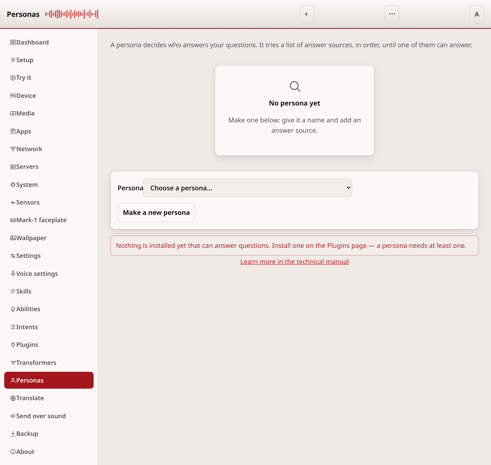
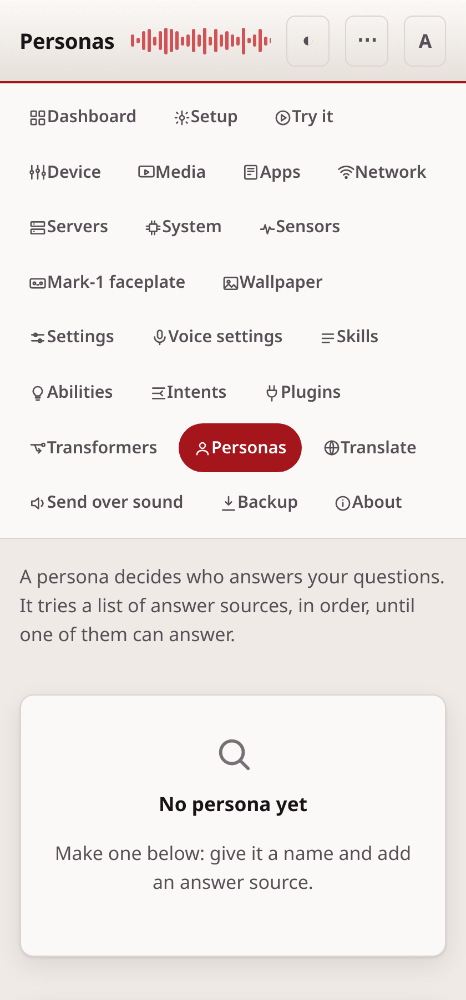

# Personas

A persona decides who answers your questions. It tries a list of answer
sources, in order, until one of them can answer. The Personas page makes and edits them.

## Common tasks

- **Make a new persona**: open the **Persona** box, type a new name, add
  answer sources, and **Save**.
- **Change which persona answers by default**: pick it, then press "Use this
  persona".
- **Check a persona before relying on it**: press **Try it** and read the
  answer.

## Choose or make one

The **Persona** box at the top picks the persona to edit, or makes a new one.
**Delete this persona** removes the one that is chosen.

## Name

- **File name**: how the persona is stored. Letters, digits, dot, dash and
  underscore only.
- **Shown name**: the name people see.
- **Catch phrase**: optional. The words that switch to this persona.
- **Memory**: an optional memory plugin, if one is installed.

## Answer sources, in order

Add the answer sources this persona should use, and order them. The first one
that can answer wins, so put the fast, certain ones first and a general one
last. **Up**, **Down** and **Remove** change the order. An answer source you
name that is not installed is marked, so you can install it from the
[Plugins](plugins.md) page.

**Advanced settings** is a JSON box for the few answer sources that need a key
or a model name. Leave it empty for the rest.

## Save and try

**Save** checks the persona first, then writes it. A persona that cannot work
is refused before it is saved. **Try it** sends a question through the persona
as it stands, so you can see who answers before you rely on it.

## Making a persona answer

"Use this persona" writes the persona's name into
`intents.persona.default_persona` in your configuration layer. This is the key
the persona service reads to decide who answers when you do not name a
persona. The page shows which persona is answering now.

If the device was already answering as a persona, switching to another one it
has loaded takes effect straight away. The persona service holds the same
configuration object the merge keeps rebuilding, so the value it reads follows
the file.

Two cases still need the OVOS services restarted. A persona you have just
created here is unknown to the service, which reads the persona files once when
it starts. And the first persona ever chosen on a device does not apply either:
until `intents.persona` exists in the configuration, the service was handed an
empty block that is not part of the merge, so later writes do not reach it.

## If it doesn't work

If **Save** refuses a persona, an answer source you named is missing or
broken. The page marks which one. Install it from the [Plugins](plugins.md)
page. For anything else, see [troubleshooting.md](troubleshooting.md).

---
[← Transformers](transformers.md) · [Home](README.md) · [Translate →](translate.md)
