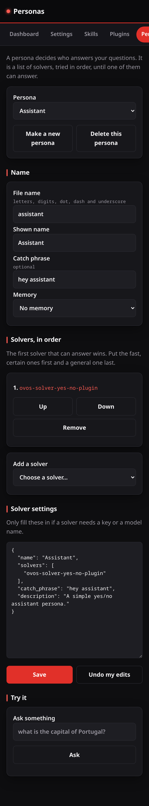

# Personas

A persona decides who answers your questions. It is a list of solvers, tried
in order, until one of them can answer. The Personas page makes and edits them.

## Choose or make one

The **Persona** box at the top picks the persona to edit, or makes a new one.
**Delete this persona** removes the one that is chosen.

## Name

- **File name** — how the persona is stored. Letters, digits, dot, dash and
  underscore only.
- **Shown name** — the name people see.
- **Catch phrase** — optional; the words that switch to this persona.
- **Memory** — an optional memory plugin, if one is installed.

## Solvers, in order

Add the solvers this persona should use, and order them. The first solver that
can answer wins, so put the fast, certain ones first and a general one last.
**Up**, **Down** and **Remove** change the order. A solver you name that is not
installed is marked, so you can install it from the [Plugins](plugins.md) page.

**Solver settings** is a JSON box for the few solvers that need a key or a
model name. Leave it empty for the rest.

## Save and try

**Save** writes the persona; it is checked first, so a persona that cannot work
is refused before it is saved. **Try it** sends a question through the persona
as it stands, so you can see who answers before you rely on it.

## Making a persona answer

"Use this persona" writes the persona's name into
`intents.persona.default_persona` in your configuration layer — the key the
persona service reads to decide who answers when you do not name a persona.
The page shows which persona is answering now. The change takes effect when
the OVOS services next restart.
