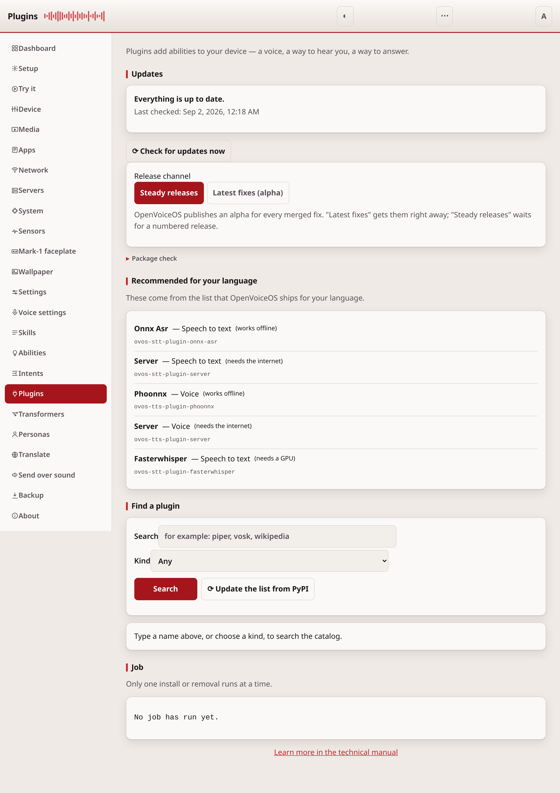
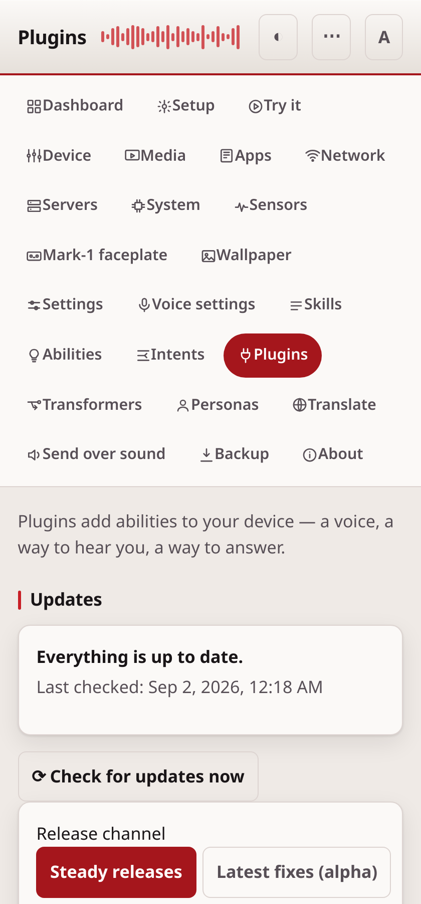

# Plugins

The Plugins page finds OVOS plugins, the voices, listeners and other add-ons
a device needs, and installs or removes them.





## Common tasks

- **Add a voice or a speech-to-text engine**: check "Recommended for your
  language" first, or search by name below.
- **Remove a plugin you no longer need**: find it in the list and press
  **Remove**.
- **See what needs a token**: every install and remove does. See
  [security.md](security.md) if you have not set one yet.

## Recommended for your language

At the top the page lists the plugins OpenVoiceOS recommends for the language
the device is set to: a speech-to-text engine, a voice, and so on. Each line
names the plugin and what it is for. This list ships with OpenVoiceOS. It is
not fetched from the internet.

## Find a plugin

Type part of a name in the search box, or choose a kind (a voice, a
speech-to-text engine, a skill, and so on) and search. The list comes from
PyPI and is kept for a while so the page stays fast; **Update the list from
PyPI** fetches it again.

Only names that start with `ovos-` are shown, and only those can be installed.

The list and the package details come from the public PyPI by default. If you
run your own package mirror, set `webui.pypi_index` in the configuration to its
base address (for example a devpi or a private PyPI), and the device reads from
there instead. A value that is not a web address is ignored, so a mistake never
sends the request somewhere unexpected.

## Install and remove

Each result says whether it is already installed. **Install** starts the
install and shows a live log as it runs. **Remove** uninstalls it. One install
runs at a time.

Installing changes the software on the device, so it **always needs a token**,
even on `127.0.0.1` where the rest of the page is open. Set one first — see
[security.md](security.md). After installing or removing a plugin, restart the
service that uses it — the **Device** page restarts the voice services together.
A skill is the exception: the skills service rescans about every thirty seconds
and picks a newly installed one up on its own.

## Where installs actually run

The web-ui never runs pip itself. It asks the device's installer services over
the message bus (`ovos.pip.install` / `ovos.pip.uninstall`). Several services
can answer: ovos-core, the audio service, the listener, the GUI service and
PHAL each run one. Every one of them is gated by the same `skills.installer`
config, so `allow_pip` has to be on for any install to happen at all. A refusal
that names a disabled pip is taken as the answer for the whole device. On a
device whose services share one configuration that is exactly right; where each
container carries its own, it can report a failure that only one service meant,
which is the price of not waiting out the full timeout on the common case.

An installer service runs pip in the process that owns the environment. This is
what makes an install land in the right place in a split or containerised
deployment. Pip in the web-ui process would put the package where nothing can
import it.

If no device is connected there is nothing to delegate to, so an install fails
with a clear message (HTTP 503) rather than touching the web-ui's own
environment. Only the package name, validated the same way as before, travels
in the bus message.

By default an install is **broadcast**: every service that has an installer
hears it, and each one installs the package into its own environment. That is
more work than a single install, and it is why the panel can offer to address
one service instead. That is the right default
because a service only answers a request addressed to it if it is new enough
to listen for one, and a request nothing answers waits out the job timeout
before reporting that nobody replied.

On a split deployment, where each service has its own environment and a plugin
has to land in a particular one, the install can be **addressed to a single
service** instead — the targeted `ovos.pip.install.<service>` topic of
`ovos_utils.skill_installer.ServiceInstaller`. Turn that on by adding a
`webui.install_services` block to the config, which says the services are new
enough to answer:

```json
{"webui": {"install_services": {"tts": "ovos_audio", "media": "broadcast"}}}
```

Every plugin family has a key. `tts`, `stt`, `wake_word`, `vad`,
`audio_transformer`, `dialog_transformer`, `gui`, `phal` and `phal_admin` are
addressed to a service by default. `media`, and everything the skills service
owns — `skill`, `solver`, `persona`, `pipeline`, `utterance_transformer`,
`lang_detect` and `translate` — are broadcast by default, because no service
answers a request addressed to them. Naming one of those in the block targets
it anyway, which is the escape hatch for a device whose layout differs.

`phal_admin` is the one key that does not match what the Plugins page shows. A
PHAL plugin that needs root — wifi setup, anything touching system services —
runs in a separate root process, so it is addressed by `phal_admin` even though
the page lists it as a PHAL plugin. Setting `phal` for one of those changes
nothing. Where an install of one goes unanswered, the message the panel shows
names the key to set.

Adding the block turns targeting on for **every** family, not only the ones
named in it: anything unnamed is addressed using the built-in routing (voices
to the audio service, listener plugins to the listener, PHAL plugins to PHAL,
and everything the skills service owns by broadcast). To keep a family on the
broadcast topic, set it to `broadcast` explicitly.

## If it doesn't work

An install that fails with "no device connected" means nothing is listening
on the message bus. Check the [Dashboard](dashboard.md) first. For anything
else, see [troubleshooting.md](troubleshooting.md).

---
[← Intents](intents.md) · [Home](README.md) · [Transformers →](transformers.md)
