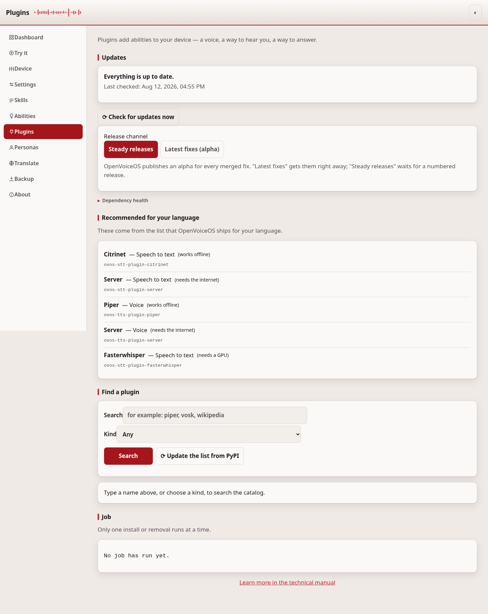
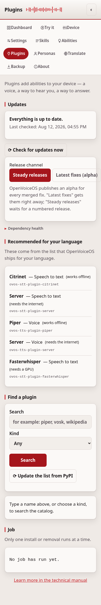

# Plugins

The Plugins page finds OVOS plugins, the voices, listeners and other add-ons
a device needs, and installs or removes them.

## Common tasks

- **Add a voice or a speech-to-text engine**: check "Recommended for your
  language" first, or search by name below.
- **Remove a plugin you no longer need**: find it in the list and press
  **Remove**.
- **See what needs a token**: every install and remove does. See
  [security.md](security.md) if you have not set one yet.

## Recommended for your language

At the top the page lists the plugins OpenVoiceOS recommends for the language
the device is set to: a speech-to-text engine, a voice, and so on. Each line
names the plugin and what it is for. This list ships with OpenVoiceOS. It is
not fetched from the internet.

## Find a plugin

Type part of a name in the search box, or choose a kind (a voice, a
speech-to-text engine, a skill, and so on) and search. The list comes from
PyPI and is kept for a while so the page stays fast; **Update the list from
PyPI** fetches it again.

Only names that start with `ovos-` are shown, and only those can be installed.

## Install and remove

Each result says whether it is already installed. **Install** starts the
install and shows a live log as it runs. **Remove** uninstalls it. One install
runs at a time.

Installing changes the software on the device, so it **always needs a token**,
even on `127.0.0.1` where the rest of the page is open. Set one first — see
[security.md](security.md). After an install or a remove, restart the affected
OVOS service for the change to take effect.

> Behind the scenes the install runs `pip` directly, never through a shell,
> with the plugin name as a single checked argument. A name with a version
> pin, an extra, an index URL, a path, or a shell character is refused before
> `pip` is reached.

## Where installs actually run

The web-ui never runs pip itself. It asks the device's installer service over
the message bus (`ovos.pip.install` / `ovos.pip.uninstall`, handled by
`ovos-core`'s skill installer and gated by its `allow_pip` config).

That service runs pip in the process that owns the environment. This is what
makes an install land in the right place in a split or containerised
deployment. Pip in the web-ui process would put the package where nothing can
import it.

If no device is connected there is nothing to delegate to, so an install fails
with a clear message (HTTP 503) rather than touching the web-ui's own
environment. Only the package name, validated the same way as before, travels
in the bus message.

Each install is **routed to the service whose environment loads that kind of
plugin**: a voice to the audio service, a listener plugin to the listener, a
skill to ovos-core, a PHAL plugin to PHAL. It uses the targeted
`ovos.pip.install.<service>` topic of `ovos_utils.skill_installer.ServiceInstaller`,
so it lands in the right container in a split deployment. A kind with no known
home uses the broadcast topic. Override the routing per family with the config
`webui.install_services` (a family set to `broadcast` uses the broadcast topic).

## If it doesn't work

An install that fails with "no device connected" means nothing is listening
on the message bus. Check the [Dashboard](dashboard.md) first. For anything
else, see [troubleshooting.md](troubleshooting.md).

---
[← Abilities](abilities.md) · [Home](README.md) · [Personas →](personas.md)
