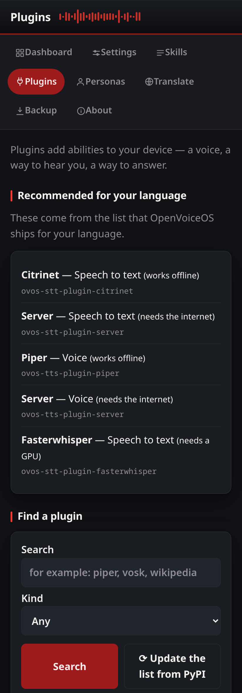

# Plugins

The Plugins page finds OVOS plugins and installs them on the device.

## Recommended for your language

At the top the page lists the plugins OpenVoiceOS recommends for the language
the device is set to — a speech-to-text engine, a voice, and so on. Each line
names the plugin and what it is for. This list ships with OpenVoiceOS; it is
not fetched from the internet.

## Find a plugin

Type part of a name in the search box, or choose a kind (a voice, a
speech-to-text engine, a skill, and so on) and search. The list comes from
PyPI and is kept for a while so the page stays fast; **Update the list from
PyPI** fetches it again.

Only names that start with `ovos-` are shown, and only those can be installed.

## Install and remove

Each result says whether it is already installed. **Install** starts the
install and shows a live log as it runs; **Remove** uninstalls it. One install
runs at a time.

Installing changes the software on the device, so it **always needs a token**,
even on `127.0.0.1` where the rest of the page is open. Set one first — see
[security.md](security.md). After an install or a remove, restart the affected
OVOS service for the change to take effect.

> Behind the scenes the install runs `pip` directly, never through a shell,
> with the plugin name as a single checked argument. A name with a version
> pin, an extra, an index URL, a path, or a shell character is refused before
> `pip` is reached.
