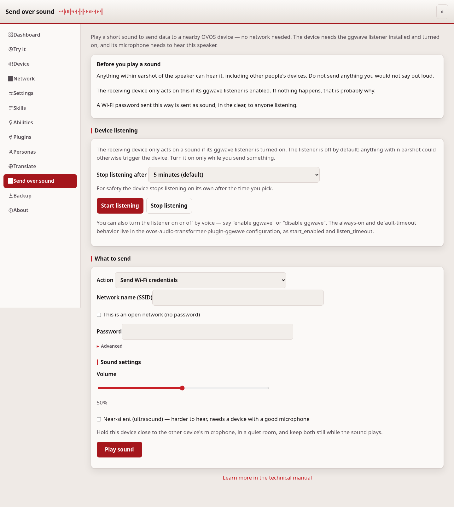
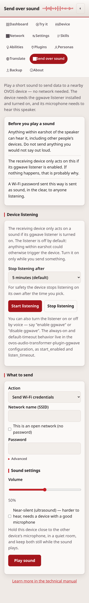

# Send over sound

This page sends data to a nearby OVOS device by playing a sound. It needs no
network. The other device hears the sound with its microphone and acts on
it.

## What it needs

The receiving device needs the `ovos-audio-transformer-plugin-ggwave` plugin
installed and listening. Install it on the [Plugins](plugins.md) page, then
turn it on. If nothing happens when you play a sound, this is the most
likely reason.

The technology behind this is [ggwave](https://github.com/ggerganov/ggwave),
a small library that encodes short text as sound and decodes it back.

## Enable listening on the device

The listener is off by default. Anything within earshot of the microphone
could otherwise trigger the device, so it only listens when you turn it on.
Turn it on before you play a sound, and it turns itself back off after a
timeout, so you do not have to remember to turn it off.

You can turn it on in three ways:

- **By voice.** Say "enable ggwave" to turn the listener on, or "disable
  ggwave" to turn it off. This needs the `ovos-skill-ggwave` skill.
- **On this page, in the webui.** Use the "Device listening" section at the
  top of the page. Pick how long the
  device should listen — 1 minute, 5 minutes (the default), 15 minutes, or
  "Until I stop it" — then press **Start listening**. Press **Stop
  listening** to turn it off early.
- **In the plugin configuration.** Set `start_enabled: true` under
  `ovos-audio-transformer-plugin-ggwave` to have the listener on from boot,
  with no timeout unless `listen_timeout` also sets one. `listen_timeout` is
  the default auto-disable time in seconds; the plugin's own default is 300
  (5 minutes), and 0 means never auto-disable.

## Common tasks

- **Give a new device Wi-Fi access** — pick "Send Wi-Fi credentials", enter
  the network name and password, and play the sound near the device's
  microphone.
- **Install a plugin without typing on the device** — pick "Install a
  plugin", enter its PyPI package name, and play the sound.
- **Install a skill from GitHub** — pick "Install a skill (GitHub)" and enter
  `owner/repo` or the full URL.
- **Make the device say or do something** — pick "Say something" to make it
  speak your text, or "Send a command" to make it act as if you had spoken
  the text.

## How it works

Choose an action, fill in the fields it needs, and press **Play sound**. The
browser turns your input into a short audio clip and plays it through your
speaker. All of the encoding happens in your browser; the webui does not
send anything over the network for this page.

Two settings change how the sound plays:

- **Volume** — how loud the sound is.
- **Near-silent (ultrasound)** — sends at a pitch most people cannot hear. It
  needs a device with a good microphone to pick it up.

Hold the sending device close to the receiving device's microphone, in a
quiet room, and keep both still until the sound finishes.

## Wi-Fi credentials

Wi-Fi is sent as two sounds, one after the other: first the network name,
then the password. The page plays them automatically in order. Check "This
is an open network" if the network has no password; the page then sends an
empty password.

## Advanced actions

Two actions are hidden under "Advanced" because they need you to already
know the OVOS message bus:

- **Trigger a bus message type** sends one bus message type with no data,
  for example to trigger an action that needs no arguments.
- **Send a bus message (JSON)** sends a complete, serialized bus message.
  This is the general-purpose carrier: anything the bus can express can be
  sent this way, including a full configuration update.

## Security

Anyone within earshot of the speaker can hear the sound, including other
people's devices. Do not send anything over sound that you would not say
out loud.

A Wi-Fi password sent this way travels as sound, in the clear, to anyone
listening. The password field is masked on screen, but the sound itself
carries the password for anyone nearby to record and decode.

The receiving device only acts on a decoded sound if its ggwave listener is
turned on. A device with the listener off, or without the plugin installed,
ignores the sound.

## If it doesn't work

If the receiving device does not react, check that the ggwave plugin is
installed and its listener is turned on. Try again in a quieter room, hold
the devices closer together, and turn off "Near-silent (ultrasound)" if the
receiving device's microphone is not good enough for it. For anything else,
see [troubleshooting.md](troubleshooting.md).

---
[← Translate](translate.md) · [Home](README.md) · [Try it →](tryit.md)
