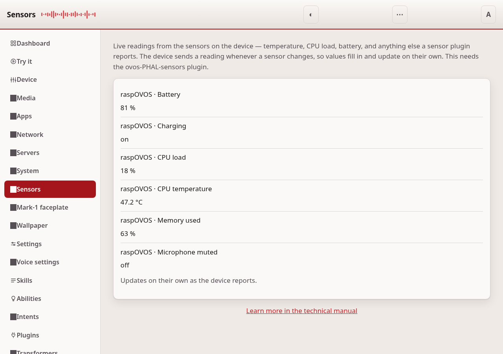
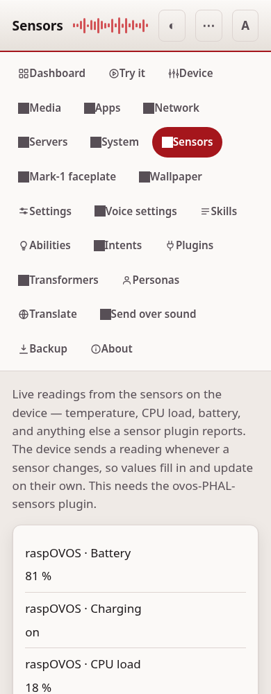

# Sensors

The Sensors page shows live readings from the sensors on the device —
temperature, CPU load, battery, and anything else a sensor plugin reports. It
needs the `ovos-PHAL-sensors` plugin. A device without it shows an empty list.

## How it works

That plugin does not answer questions. Instead it sends out a reading every time
a sensor changes. So the panel listens for those readings and keeps the latest
value of each sensor, and the page refreshes on its own every few seconds. When
a sensor first reports, it appears in the list; after that its value updates in
place.

A plain sensor shows its value and its unit, like `42 °C` or `63 %`. An on/off
sensor, such as whether the device is charging, shows on or off.

## This page needs a token

The page reads from the running device, so it needs an access token, the same as
the other device pages. Set one on the [Settings](configuration.md) page first.

---
[← System](system.md) · [Home](README.md) · [Backup →](backup-restore.md)
