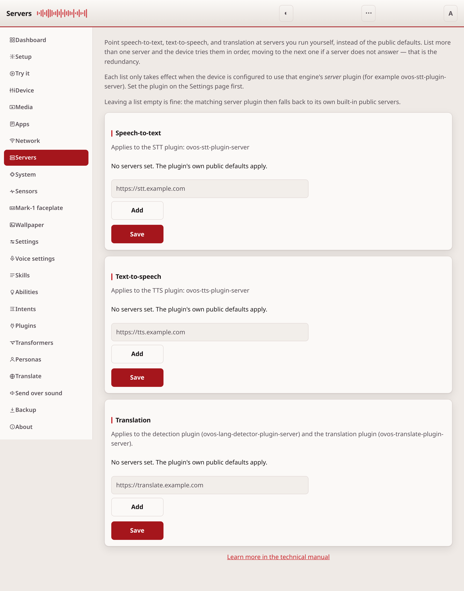
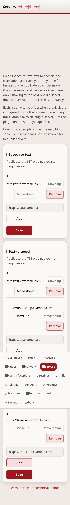

# Servers

The Servers page points speech-to-text, text-to-speech, and translation at
servers you run yourself, instead of the public defaults built into each
plugin.

## What it needs

Each list only takes effect when the device uses that engine's *server*
plugin:

| Engine | Server plugin |
|---|---|
| Speech-to-text | `ovos-stt-plugin-server` |
| Text-to-speech | `ovos-tts-plugin-server` |
| Translation | `ovos-lang-detector-plugin-server` and `ovos-translate-plugin-server` |

Those are plugin names, and only the first two are also package names. The two
translation plugins both come from `ovos-translate-server-plugin`, so that is
what to install.

Set the plugin on the [Settings](configuration.md) page first. A URL list
saved here does nothing if the device uses a different plugin for that
engine.

## Read it top to bottom

The page has three sections, one per engine: **Speech-to-text**,
**Text-to-speech**, and **Translation**. Each section shows:

1. The plugin the list applies to.
2. The current ordered list of servers.
3. A box to add a new server, and Up, Down, and Remove buttons on each
   entry.
4. A **Save** button. Nothing is sent to the device until you press it.

## Failover

The device tries the servers in the order you set, top first. If a server
does not answer, it moves to the next one on the list. This gives you
redundancy: put your main server first and a backup server after it.

An empty list is not an error. The matching server plugin then falls back
to its own built-in public servers.

## No secrets here

This page stores only server addresses. It does not store passwords, API
keys, or any other credential. If your server needs authentication, set
that up through the plugin's own configuration on the [Settings](configuration.md)
page instead.

## If it doesn't work

If a server does not respond, check that its address is correct and that
the device can reach it. For anything else, see
[troubleshooting.md](troubleshooting.md).

---
[← Network](network.md) · [Home](README.md) · [Mark-1 faceplate →](mark1.md)
