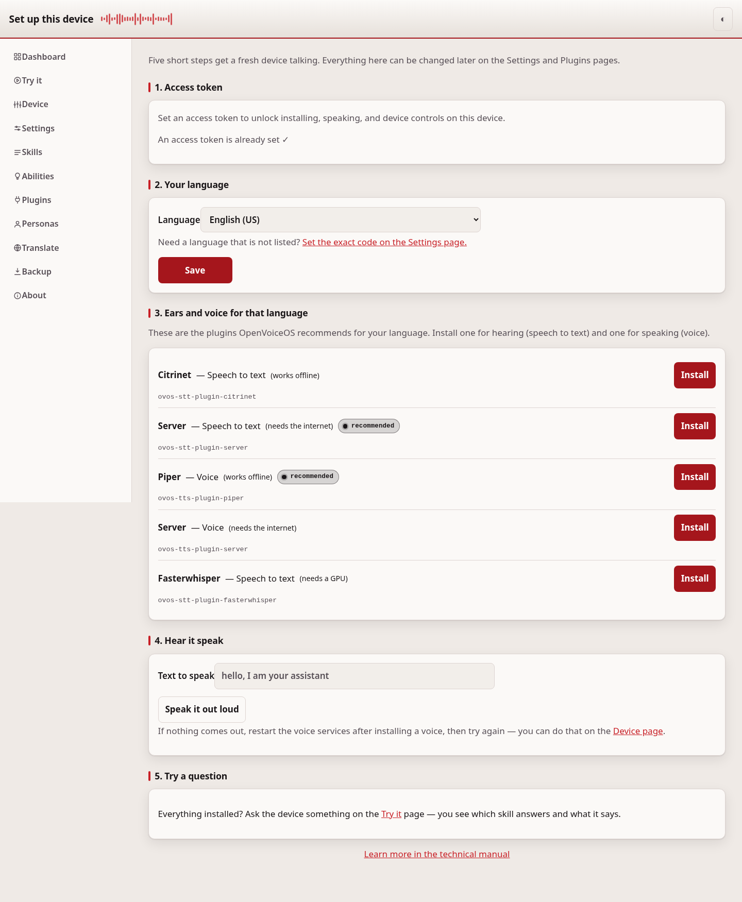
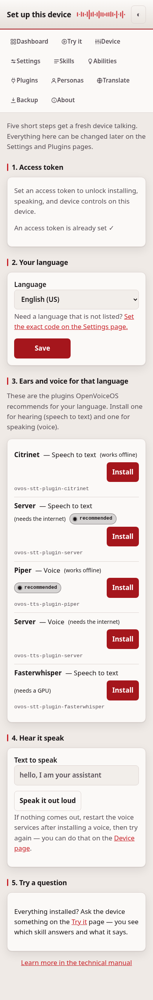

# Set up this device

This wizard gets a freshly-flashed device talking, in four steps: language,
hearing and voice plugins for that language, a sound check, then a first
question. Everything it touches can be changed later on the Settings and
Plugins pages, so you cannot get it wrong.

## How to get through it

1. **Language** writes `lang` into your configuration layer, and the plugin
   recommendations below it re-load for the new language.
2. **Ears and voice** lists the plugins OpenVoiceOS recommends for that
   language. Tap **Install** next to each one you need — this uses the same
   guarded installer as the Plugins page.
3. **Hear it speak** sends a `speak` message so you can confirm sound comes
   out of the device.
4. **Try a question** hands you over to the [Try it](tryit.md) page, where you
   can type a real question and see the device answer.

Installing plugins needs the access token, like every install — see
[security.md](security.md).

## If it doesn't work

If a plugin fails to install or the device stays silent, see
[troubleshooting.md](troubleshooting.md).

---
[← Dashboard](dashboard.md) · [Home](README.md) · [Settings →](configuration.md)
