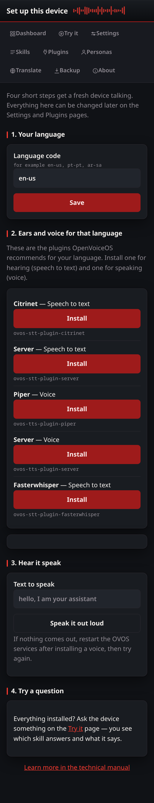

# Set up this device

A short path from a freshly-flashed device to one that talks: language,
hearing and voice plugins for that language, a sound check, then a first
question. Everything the wizard touches can be changed later on the Settings
and Plugins pages.

## The steps

1. **Language** writes `lang` into your configuration layer, and the plugin
   recommendations below it re-load for the new language.
2. **Ears and voice** lists the plugins OpenVoiceOS ships as recommendations
   for that language, with one-tap install through the same guarded installer
   the Plugins page uses.
3. **Hear it speak** sends a `speak` message so you can confirm sound comes
   out.
4. **Try a question** hands over to the [Try it](tryit.md) page.

Installing plugins needs the access token, like every install.
