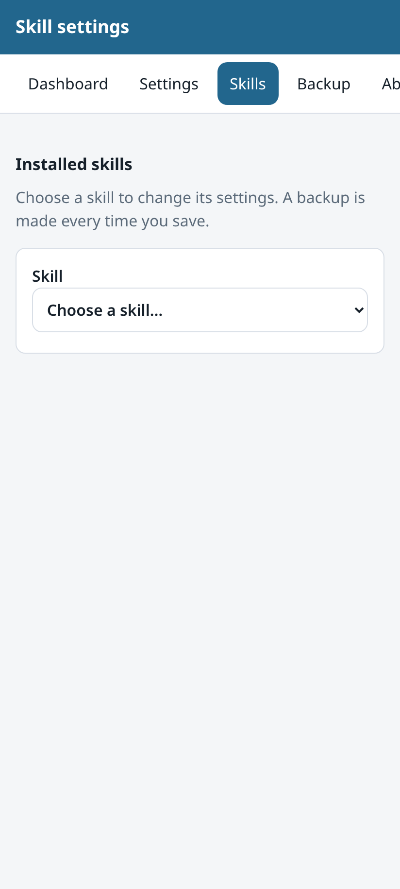

# Skill settings

Each skill keeps its own settings. The Skills page lists the skills that have a
settings directory on this device, and lets you change them.



## Where the files are

A skill keeps its settings in:

```
<XDG config>/<base>/skills/<skill id>/settings.json
```

This is the same path that `ovos-workshop` uses, so a change here is what the
skill reads.

## The form

A skill can ship a `settingsmeta.json` or a `settingsmeta.yaml` that describes
its fields. When it does, the page shows a form with a label for each field.

When it does not, the page builds a form from the values already in
`settings.json`, with `ovos_workshop.settings.settings2meta`. The page says so.

A key that the form does not cover stays in the file. The page names those keys
and you can edit them with the "Edit as JSON" button.

Keys that start with an underscore are internal. The page leaves them alone.

## Safety

The skill id in the address is checked before it reaches the file system. It
must be a plain name: letters, digits, dot, dash and underscore. A name with a
slash, a parent reference, a null byte or a leading dot is refused. The path
that comes out of the check is then checked again against the skills directory.

## Backups

Every save first copies the old `settings.json` into a `.ovos-webui-backups`
directory beside it. The last 20 copies are kept.
