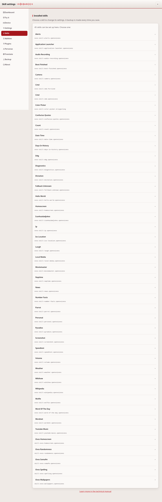
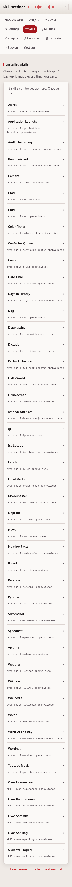

# Skill settings

This page changes what an individual skill is configured to do — for example
an API key it needs, or a city it should use by default. It lists the skills
that have settings on this device.





## Common tasks

- **Change what a skill does** — pick the skill from the list, fill in the
  form, and save.
- **Edit a value the form does not show** — use the "Edit as JSON" button.
- **Turn a skill off without removing it** — see "Turning a skill off" below.

## Where the files are

A skill keeps its settings in:

```
<XDG config>/<base>/skills/<skill id>/settings.json
```

This is the same path that `ovos-workshop` uses, so a change here is what the
skill reads.

## The form

A skill can ship a `settingsmeta.json` or a `settingsmeta.yaml` that describes
its fields. When it does, the page shows a form with a label for each field.

When it does not, the page builds a form from the values already in
`settings.json`, with `ovos_workshop.settings.settings2meta`. The page says so.

A key that the form does not cover stays in the file. The page names those keys
and you can edit them with the "Edit as JSON" button.

Keys that start with an underscore are internal. The page leaves them alone.

## Safety

The skill id in the address is checked before it reaches the file system. It
must be a plain name: letters, digits, dot, dash and underscore. A name with a
slash, a parent reference, a null byte or a leading dot is refused. The path
that comes out of the check is then checked again against the skills directory.

## Backups

Every save first copies the old `settings.json` into a `.ovos-webui-backups`
directory beside it. The last 20 copies are kept.

## Turning a skill off

The editor shows whether the chosen skill is on, with one button to turn it
off or back on. Off means the skill id is added to
`skills.blacklisted_skills` in your configuration layer: the skill stays
installed and keeps its settings, it just does not load.

Turning a skill on takes effect on its own: the skills service re-reads the
list about every thirty seconds and loads anything no longer blocked. Turning
one off only stops it loading next time, because nothing unloads a skill that
is already running, so it keeps answering until the OVOS services restart. The
page says which of the two happened.

## If it doesn't work

If a skill does not show up here, it has no settings directory yet. Check the
[Abilities](abilities.md) page to confirm it is installed. For anything else,
see [troubleshooting.md](troubleshooting.md).

---
[← Voice settings](voice-settings.md) · [Home](README.md) · [Abilities →](abilities.md)
