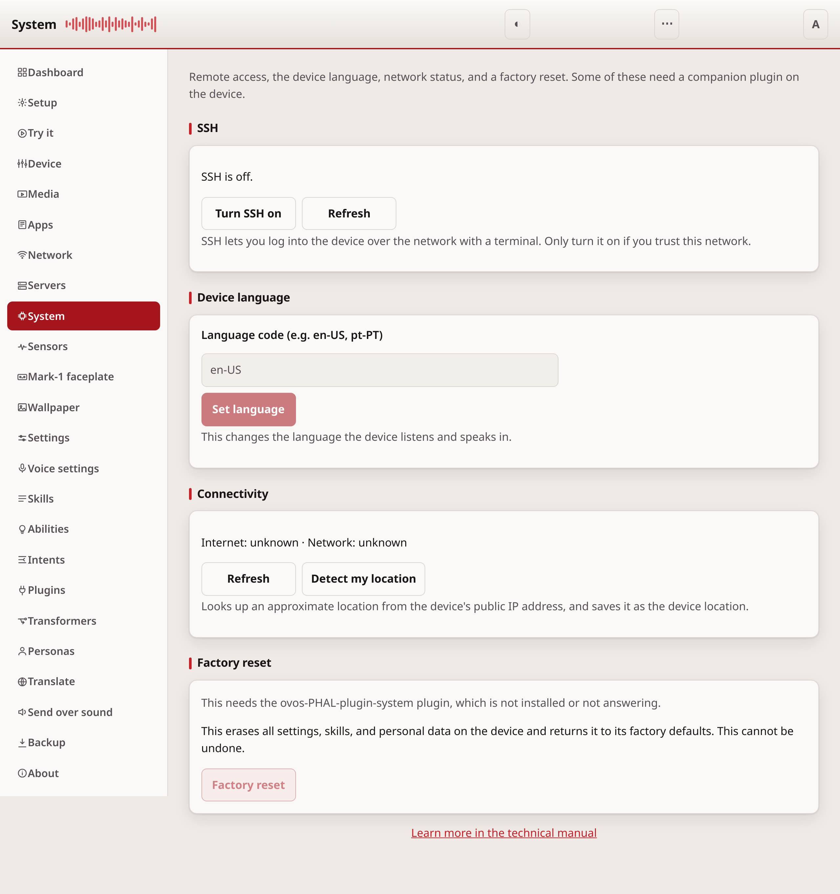
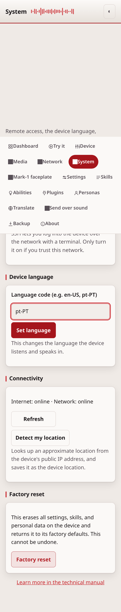

# System

SSH access, the device language, network status, and a factory reset.
These are the controls you reach for when setting up or troubleshooting
a device.

## What it needs

SSH, the language control, and factory reset need the
`ovos-PHAL-plugin-system` plugin, installed and running on the device.
Connectivity needs `ovos-PHAL-plugin-connectivity-events`. Detect my location
needs `ovos-PHAL-plugin-ipgeo`. Install any of these on the
[Plugins](plugins.md) page. Where a plugin is missing, the matching part of
the page shows a note instead of a working control.

## Read it top to bottom

The page has four parts, in this order:

1. **SSH**: shows whether SSH is on, and a button to turn it on or off. SSH
   lets you log into the device over the network with a terminal. Turning it
   off or on asks you to confirm first.
2. **Device language**: a text field for a language code, such as `en-US`
   or `pt-PT`, and a button to set it. This changes the language the device
   listens and speaks in.
3. **Connectivity**: whether the device currently has network and internet
   access. Press **Refresh** to check again. **Detect my location** looks up
   an approximate location from the device's public IP address and saves it
   as the device location. Review it afterwards on the
   [Settings](configuration.md) page.

   The lookup goes out to the internet, so give it a few seconds. It writes
   the location into the lowest configuration layer the device reads, which
   means a location you have set yourself keeps winning; when that happens the
   page says so and points you at the Settings page to clear it. On a device
   whose administrator has switched off the remote configuration layer, or
   protected the location key, the detected location cannot be stored at all
   and the page says that instead — there is nothing to clear, and the device
   keeps the location it has.
4. **Factory reset**: erases all settings, skills, and personal data, and
   returns the device to its factory defaults.

## Before you reset

**A factory reset cannot be undone.** It erases everything on the device:
settings, skills, and personal data. The button asks you to type `RESET`
and then confirm before it sends anything. Make a [backup](backup-restore.md)
first if you want to keep your settings.

## If it doesn't work

If a part of the page shows a message that a plugin is missing, install the
plugin it names on the [Plugins](plugins.md) page and restart the PHAL
service. For anything else, see [troubleshooting.md](troubleshooting.md).

---
[← Mark-1 faceplate](mark1.md) · [Home](README.md) · [Sensors →](sensors.md)
