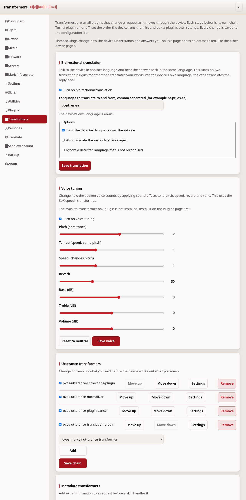
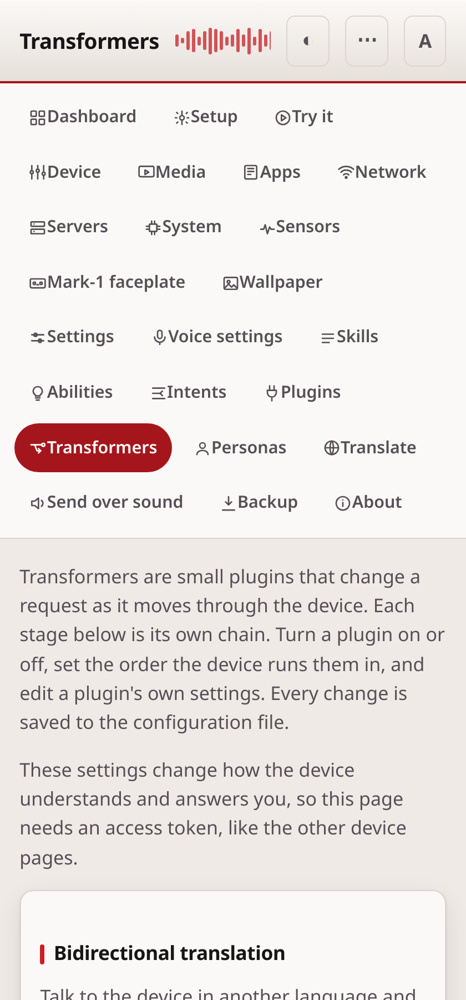

# Transformers

Transformers are small plugins that change a request as it moves through the
device. The device runs six chains of them, one after another. This page turns
a plugin on or off, sets the order the device runs them in, and edits a
plugin's own settings. Every change is saved to the configuration file, the
same layer the Settings page edits.

## The six chains

Each chain has its own section in the configuration and its own set of
installed plugins. They run in this order for a request:

1. **Utterance transformers** change or clean up what you said before the
   device works out what you mean.
2. **Metadata transformers** add extra information to a request before a skill
   handles it.
3. **Intent transformers** change a matched intent before the skill runs.
4. **Audio transformers** act on the captured audio, for example to detect a
   sound or a language.
5. **Dialog transformers** change a reply's text before the device speaks it.
6. **Speech transformers** change the synthesized audio after text-to-speech,
   for example to tune the voice.

## Bidirectional translation

The card at the top turns on translation in both directions with one switch.
Talk to the device in another language and hear the answer back in the same
language. It adds two plugins together: one translates your words into the
device's own language, the other translates the reply back.

To set it up, turn it on, then list the languages to translate to and from,
comma separated (for example `pt-pt, es-es`). The options let you trust a
detected language over the set one, also translate the secondary languages, or
ignore a language that is not recognised.

## Voice tuning

The Voice tuning card changes how the spoken voice sounds. Move the sliders for
pitch, tempo, speed, reverb, bass, treble and volume, then press Save voice. A
slider left in the middle does not change the sound. This uses the SoX speech
transformer, so it needs the `ovos-tts-transformer-sox-plugin` installed. Press
Reset to neutral to clear every effect.

## Turn a plugin on or off

Each chain lists the plugins it has configured. A checked box means the plugin
is active. Uncheck it to keep the plugin and its settings but stop the device
from running it. To add a plugin, pick one from the list of installed plugins
and press Add. To drop a plugin from the chain, press Remove.

Press **Save chain** to write the changes for that chain.

## Set the order

The device runs the plugins of a chain from top to bottom. Use Move up and
Move down to change the order, then press Save chain. The order you see is the
order the device uses.

## Edit a plugin's settings

Press **Settings** on a plugin to open its own configuration block. The block
is shown as JSON. Change a value and press Save settings. The device reads this
block when it loads the plugin. A plugin that has no settings shows an empty
block.

If the text is not valid JSON, or is not a JSON object, the page refuses the
save and tells you why. The plugin's on or off state is kept when you save its
settings.

## This page needs a token

These settings change how the device understands and answers you. Both reading
and changing them need an access token, the same as the other device pages. Set
one on the [Settings](configuration.md) page first.

## After a save

Most changes apply as soon as you save. `ovos-config` watches the file and
reads it again when it changes, and the audio and listener services act on the
`configuration.patch` message the page sends. Whether a given plugin picks a new
setting up without being restarted is up to that plugin. If a change does not
seem to take effect, restart the OVOS services. The Device page has a button
for it, which works where `ovos-PHAL-plugin-system` is installed; without that
plugin, restart them from a terminal.

---
[← Plugins](plugins.md) · [Home](README.md) · [Personas →](personas.md)
