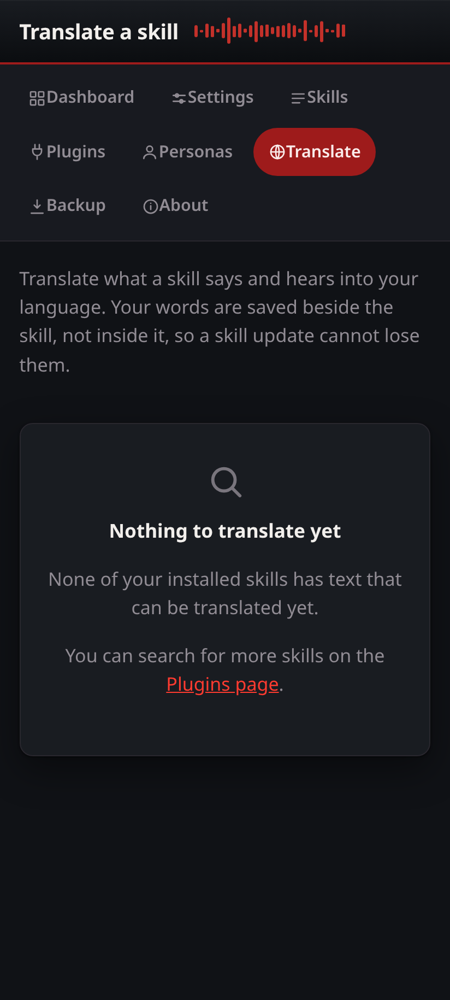

# Translate a skill

The Translate page changes what a skill says and hears, into your language.
Your words are saved beside the skill, not inside it, so a skill update cannot
lose them.

## How it works

A skill ships its words — the things it says, and the phrases it listens for —
in files, one set per language. This page lets you write your own set for a
language the skill does not ship, or improve one it does. Your set is stored in
the device's own data directory and is read before the skill's own files, so it
wins without touching the installed skill.

## Steps

1. **Skill** — choose the skill to translate. If the list is empty, no skill is
   installed on the device yet.
2. **Translate from** — the language to start from, usually the one the skill
   ships in.
3. **Translate into** — the language code to write, for example `pt-pt`.
4. **File** — the resource file to work on.

You then see the original lines beside your own. Fill in yours and save.

## Machine help

If a translate plugin is installed, the page can fill in a first draft for you.
A machine draft is marked as a draft until you accept it, so an automatic
translation is never mistaken for one a person checked.
