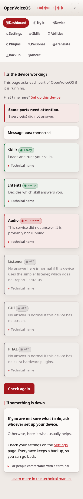
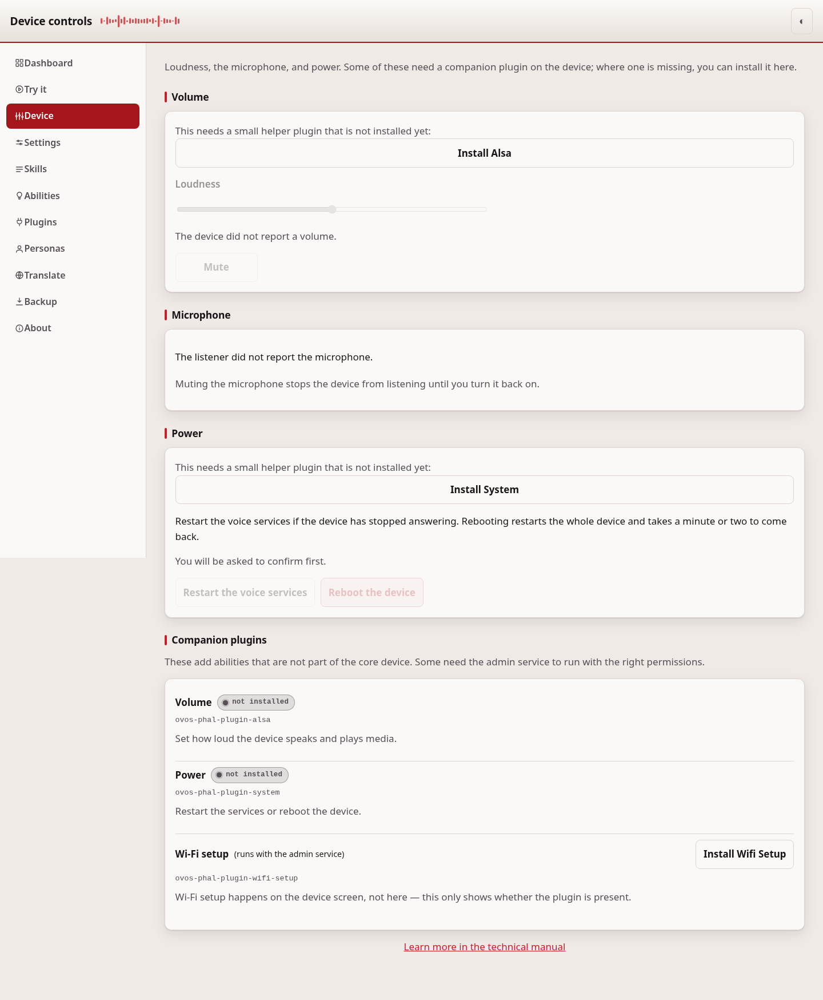

# Troubleshooting

The common problems a first-time device owner hits, and how to fix them. If
you have not been through the first-run steps yet, start with
[Getting started](getting-started.md) instead — most of this goes away once
that is done in order.

## "The device isn't responding" / a service says "no answer"

**Symptom:** The Dashboard shows a red or grey card, or says "no answer."



**Cause:** That service is not running, or the message bus itself is down. If
the bus card itself shows "no answer," nothing else can be checked either —
every OVOS service talks through the bus.

**Fix:** Start the message bus first, then the affected service:

```bash
systemctl --user restart ovos-messagebus
systemctl --user restart ovos-skills
```

Wait a few seconds and reload the Dashboard. A grey "off" card is normal for
a part your device does not have, like a screen — that is not a problem.

## "A valid token is needed" / I can't do anything

**Symptom:** Every action fails with a message about a token, or a red banner
says no token is set.

**Cause:** This is the most common wall. Installing plugins, sending a test
question, and using the device controls always need a token, even if the
page itself is open on `127.0.0.1`.

**Fix:** Go to **Setup** or **Settings → Access token** and set one. See
[Getting started](getting-started.md) step 2.

## I installed a plugin but nothing changed

**Symptom:** A plugin shows as installed, but the device still behaves as
before.

**Cause:** A new plugin only loads when the service that uses it restarts.

**Fix:** Go to **Device controls** and restart the affected service (or
reboot the device). On a device where services are split across containers,
the plugin is installed into the container that owns that service, not into
the web-ui's own environment — restarting that specific service is what
picks it up.

## "Sent. Listen to the device" but I hear nothing

**Symptom:** On the Try it page, the answer text appears but no sound comes
out of the device.

**Cause:** No text-to-speech plugin (a voice) is installed yet.

**Fix:** Go to **Plugins**, install a voice for your language, then restart
the audio service on **Device controls**. See
[Getting started](getting-started.md) step 4.

## I can't sign in

**Symptom:** The sign in page rejects the token you type.

**Cause:** The token is wrong, or you are looking at an old one.

**Fix:** The current token is whatever you set in `mycroft.conf` under
`webui.access_token`, or whatever you passed with `--token` when the service
started. If you forgot it, set a new one from a shell on the device:

```json
{"webui": {"access_token": "a new long random string"}}
```

Then restart `ovos-control-panel`.

## Installing does nothing / says no device

**Symptom:** Pressing **Install** on the Plugins page fails, often with an
error mentioning "503."

**Cause:** The web-ui never installs a plugin itself. It asks the device's
installer service to do it, over the message bus. If no service is connected
to answer that request, or that service's `allow_pip` setting is off, there
is nothing to install into.

**Fix:** Make sure `ovos-core` (or the relevant split service) is running and
connected to the bus, and that pip installs are allowed in its configuration.
Then try the install again.

## Volume or Wi-Fi controls are greyed out

**Symptom:** On **Device controls**, the volume slider or another control is
disabled.



**Cause:** That control is carried by a companion PHAL plugin — for example,
volume needs an audio plugin such as `ovos-PHAL-plugin-alsa`. If it is not
installed, the page has nothing to talk to.

**Fix:** The Device controls page tells you which plugin is missing and
offers to install it. Press install, then restart the relevant service. Some
controls also need the admin service (`ovos-PHAL-admin`). The page labels
those.

---
[Home](README.md)
