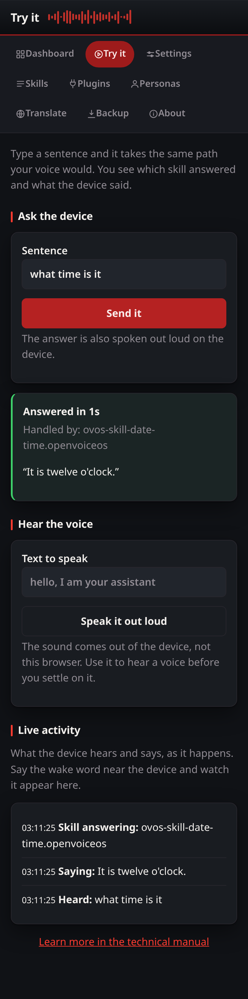

# Try it

The dashboard answers "is each part running?". This page answers "does it
actually work?": type a sentence and it takes the exact path a spoken one
would.

## Ask the device

The sentence goes over the message bus as `recognizer_loop:utterance` — the
same message the listener sends after it transcribes your speech. The page
then reports:

- which skill took the utterance (`mycroft.skill.handler.start`),
- every sentence the device answered with (`speak`),
- or that nothing matched (`complete_intent_failure`).

The answer is also spoken out loud on the device, because a real `speak`
message went out.

## Hear the voice

"Speak it out loud" sends a plain `speak` message. Use it to hear a voice
before settling on it in Settings, or to check the speaker works at all.

## Live activity

The service keeps a small ring buffer of the voice traffic it sees — wake
word, listening, what was heard, what was said. The page polls it, so you can
say the wake word near the device and watch the exchange appear. The buffer
holds the last 100 events as plain text; no audio is kept.

## Security

Sending an utterance is running a command on the device, so both actions sit
on the privileged router: they always need the access token, like the plugin
installer, whatever address the service binds to. No new bus message type is
introduced anywhere on this page.
