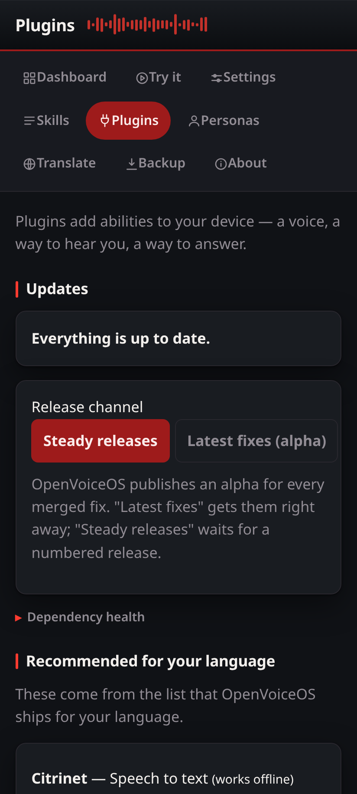

# Updates, release channel and dependency health

The Plugins page carries three related tools.

## Updates

The service compares every installed `ovos-*` package with PyPI and lists the
ones that are behind, with an Upgrade button each. Upgrades run through the
same argument-vector-only pip runner as installs — one job at a time, output
streamed to the page, token always required. Version answers are cached for
six hours; an unreachable PyPI never blocks the page.

## Release channel

OpenVoiceOS publishes an alpha release for every merged fix.

- **Steady releases** (default): pip only moves between numbered releases.
- **Latest fixes (alpha)**: installs and upgrades pass `--pre`, so the newest
  alpha is eligible.

The choice is stored as `webui.release_channel` in your configuration layer.
Changing it needs the token, because it changes what future installs do.

## Dependency health

"Dependency health" runs `pip check` — a constant argument vector with no
request data in it — and shows what pip reports. A conflict usually clears
after upgrading the named packages.
