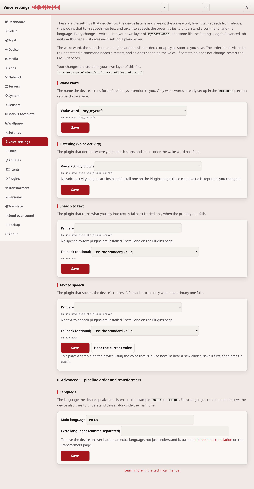
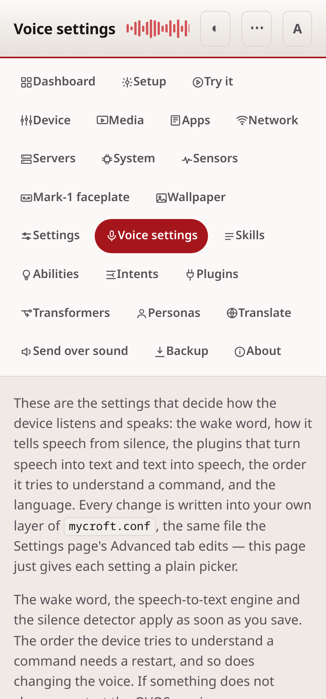

# Voice settings

The Voice settings page gives plain pickers for the settings that decide how
the device listens and speaks. The Settings page's Advanced tab can already
change these, as raw text. This page shows the same values as dropdowns and
lists, with the current value in use, and the options limited to what is
really installed.

## Common tasks

- **Change the wake word**: pick a new one under Wake word. Only wake words
  already set up in the `hotwords` section of your configuration can be
  chosen.
- **Switch the voice or the speech-to-text plugin**: pick a new value under
  Text to speech or Speech to text. Both also take an optional fallback,
  tried only when the primary plugin fails.
- **Change the order the device tries to understand you**: reorder the list
  under Pipeline order.
- **Turn a transformer on or off**: check or uncheck it under Transformers.
- **Switch the device's language**: set it under Language.

## Wake word

The word or phrase the device listens for before it pays attention to the
rest of what you say. The list only offers wake words already set up in the
`hotwords` section of your configuration. A name typed here that is not set
up there would leave the device unable to start listening.

## Listening (voice activity)

The plugin that decides where your speech starts and stops once the wake
word has fired. This does not choose which words were said. That job is
speech-to-text. It only marks the boundary of a spoken command.

## Speech to text

The plugin that turns what you say into text, plus an optional fallback. The
fallback is only tried when the primary plugin fails, for example when it
needs a network connection that is down.

## Text to speech

The plugin that speaks the device's replies, plus an optional fallback, tried
the same way as the speech-to-text fallback.

## Pipeline order

When you speak, the device tries each stage in this list in order and stops
at the first one that understands you. A stage earlier in the list is tried
sooner. Move a stage up or down, or remove it. Add a new one from the
plugins installed on the device.

## Transformers

Utterance transformers change or clean up what you said before the device
tries to understand it. One example is correcting a word it often
mis-hears. Metadata transformers add extra information to a request before
it is handled. Each is a plugin you can turn on or off. A plugin's own
settings, if it has any, stay as they are when you leave it turned on.

## Language

The language the device speaks and listens in, for example `en-us` or
`pt-pt`. Extra languages can be listed too. The device also tries to
understand those, alongside the main one.

## After a save

The wake word, the speech-to-text engine and the silence detector apply as
soon as you save: the listener watches for configuration changes and rebuilds
whichever part changed.

Two do not. The pipeline order is read into the session when the skills service
starts and is not re-read afterwards. Changing the voice is unreliable, because
ovos-audio decides whether to reload by hashing the selected plugin's own
settings and not the plugin name, so a swap between two plugins that have no
settings of their own looks like no change to it.

If a change does not seem to take effect, restart the OVOS services. The Device
page has a button for it, which works where `ovos-PHAL-plugin-system` is
installed; without that plugin, restart them from a terminal.

Every save first copies the old file into `.ovos-webui-backups` beside it,
the same backup the Settings page makes.

## This page needs a token

Because these settings change how the device listens and speaks, both
reading and changing them need an access token, the same as installing a
plugin or controlling the device does. Set one on the
[Settings](configuration.md) page first.

## If it doesn't work

If a save is refused, the page explains what was wrong with the value. Two
examples are a language that is not a valid code, or a pipeline list with a
repeated entry. For anything else, see [troubleshooting.md](troubleshooting.md).

---
[← Settings](configuration.md) · [Home](README.md) · [Skill settings →](skill-settings.md)
