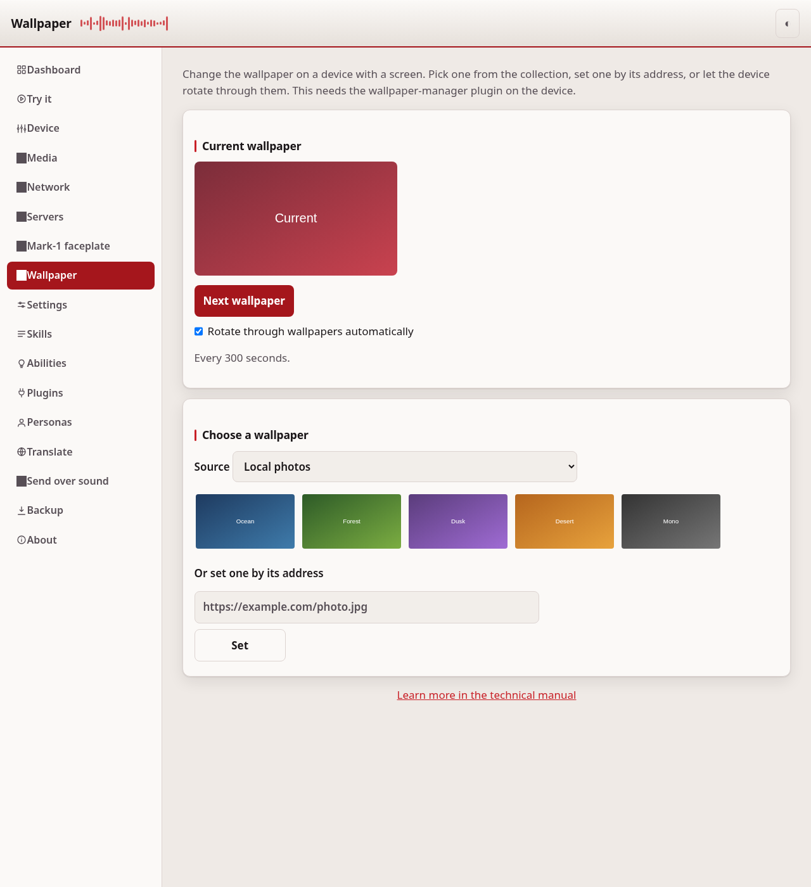
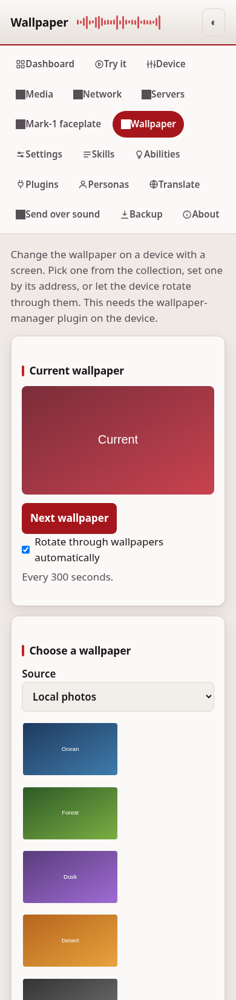

# Wallpaper

The Wallpaper page changes the background on a device with a screen. Pick one
from the collection, set one by its address, or let the device rotate through
them on its own. It talks to the wallpaper-manager plugin on the device. A
device without that plugin, or without a screen, says the wallpaper manager did
not answer.

## The current wallpaper

The top card shows the wallpaper in use. Press Next wallpaper to move to the
next one in the current source. Turn on **Rotate through wallpapers
automatically** to let the device change it on a timer. When rotation is on, the
page shows how often the wallpaper changes.

## Choose a wallpaper

If the device has more than one source, pick one under Source. The gallery shows
the wallpapers that source offers. Select one to set it right away.

To use a picture that is not in the gallery, type its address under **Or set one
by its address** and press Set. A web address is downloaded and stored on the
device.

## This page needs a token

Changing the wallpaper changes what the device shows, so this page needs an
access token, the same as the other device pages. Set one on the
[Settings](configuration.md) page first.

---
[← Mark-1 faceplate](mark1.md) · [Home](README.md) · [Backup →](backup-restore.md)
